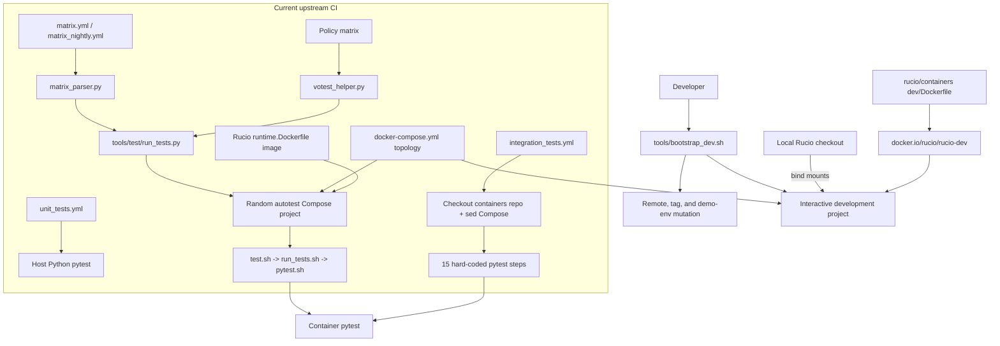
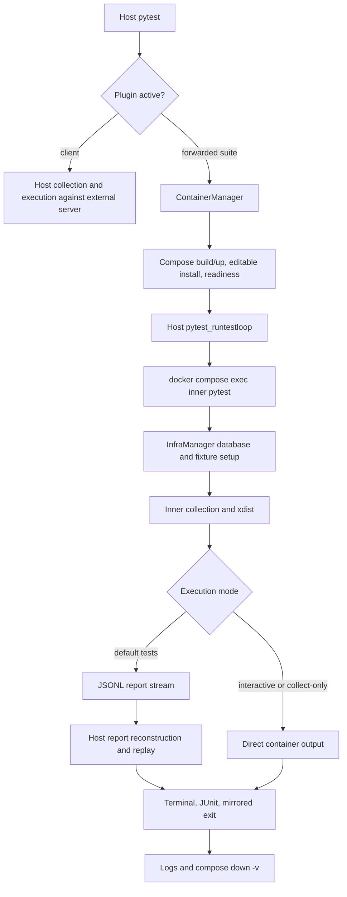
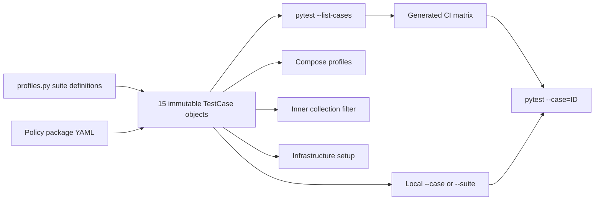
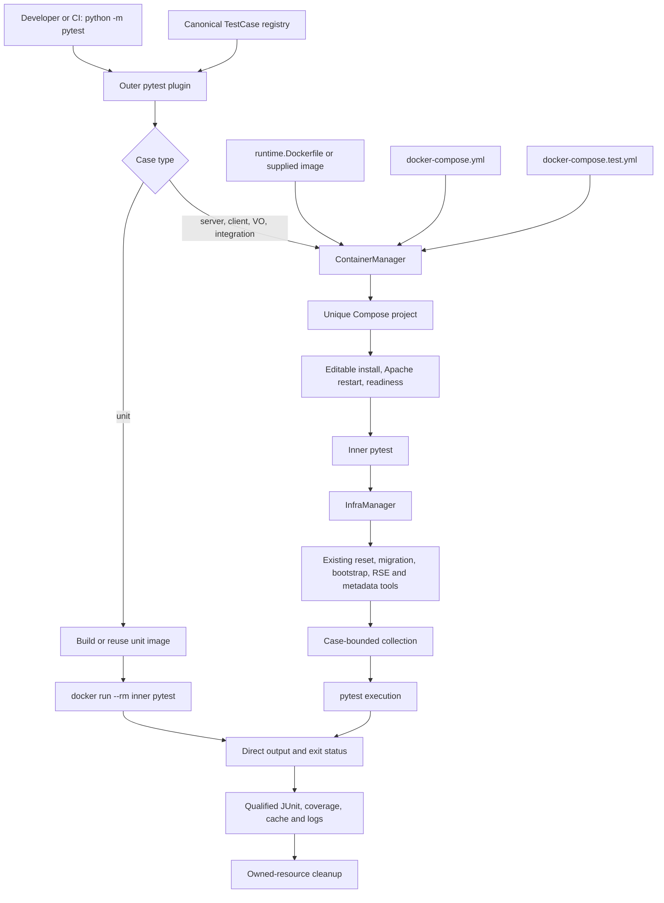
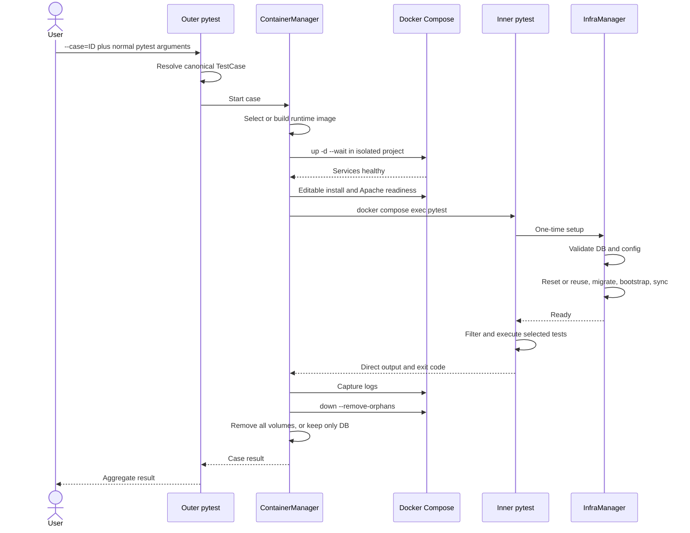
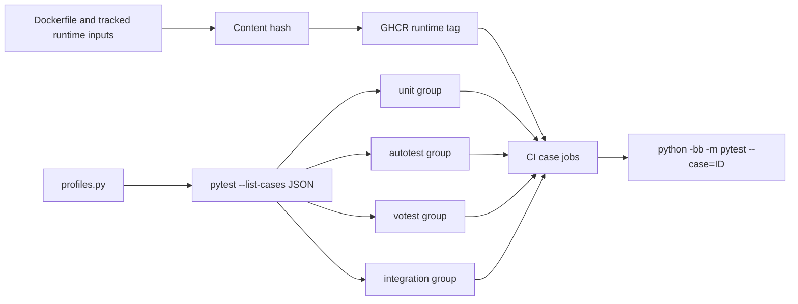
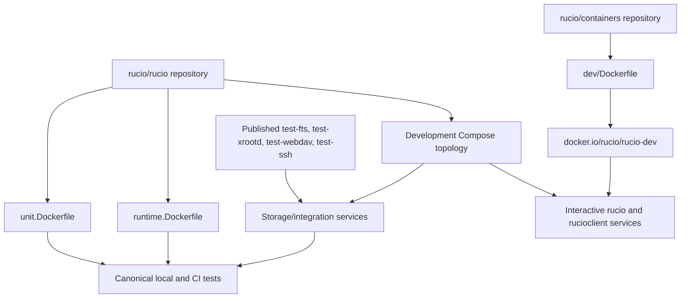

# Rucio development and testing architecture

<!-- markdownlint-disable MD013 MD060 -->

This document explains three related systems:

1. the current upstream Rucio development and test architecture;
2. [`maany/rucio#3`](https://github.com/maany/rucio/pull/3), the first pytest-runner proposal;
3. the container-native testing system published on the
   [`testing-refactor`](https://github.com/Geogouz/rucio/tree/testing-refactor)
   branch.

It also provides a complete user guide for that system.

## Contents

- [Revision anchors and scope](#revision-anchors-and-scope)
- [Executive conclusions](#executive-conclusions)
- [Current upstream architecture](#current-upstream-architecture)
- [PR #3 architecture](#pr-3-architecture)
- [Current solution architecture](#current-solution-architecture)
- [PR #3 versus the current solution](#pr-3-versus-the-current-solution)
- [Current upstream versus the current solution](#current-upstream-versus-the-current-solution)
- [External image ownership](#external-image-ownership-and-remaining-duplication)
- [Complete user guide](#part-ii-complete-user-guide)
- [Runner CLI reference](#runner-cli-reference)
- [Interactive development](#interactive-development-environment)
- [Troubleshooting](#invalid-combinations-and-troubleshooting)
- [Maintenance](#maintaining-or-extending-the-architecture)
- [Validation status](#validation-status-at-the-pinned-revision)
- [Source index](#source-index)

## Revision anchors and scope

The comparison is pinned to commits so that “current”, “PR #3”, and “this
solution” remain unambiguous.

| Name used here | Exact revision | Notes |
|---|---|---|
| Current upstream | [`rucio/rucio@1196c87d`](https://github.com/rucio/rucio/commit/1196c87d832230fa034ae4c3eb2877998cb8cc4f) | Live `master` verified on 2026-07-14 |
| PR #3 base | `801caf7459a2b9139ad6b26b3d268054f214e560` | `maany/master` at the PR base |
| PR #3 head | [`c001a3ae`](https://github.com/maany/rucio/commit/c001a3ae21366e0fb65f991ece06793efe396063) | Three commits; 26 files; +6,042/-37 |
| This solution | [`Geogouz/rucio@0d5ad34f`](https://github.com/Geogouz/rucio/commit/0d5ad34f6cc729c32acd69da8ad8c14a4075078f) | Implementation snapshot before this documentation update; 192 commits over current upstream; 77 files; +9,031/-3,544 |
| Containers repository | [`rucio/containers@b79108c1`](https://github.com/rucio/containers/commit/b79108c106e4c49f07965adfca4a031d437f0a21) | Used to describe the external `rucio-dev` image |

The current solution is published on the `testing-refactor` branch of the
`Geogouz/rucio` fork and is not claimed to be merged upstream. The document
distinguishes implemented behavior from recommended future work.

### Terminology

- A **suite definition** describes a supported family such as `remote_dbs`.
- A **case** is one exact, reproducible local/CI permutation such as
  `remote-dbs-py310-oracle`.
- A **Compose profile** selects services, such as `storage` or `oracle`. It is
  infrastructure, not a test suite.
- The **outer pytest** process runs on the host and orchestrates a case.
- The **inner pytest** process runs in the case's container and executes tests.
- The **interactive environment** is a long-lived development Compose project.
  It is separate from the disposable projects created by the canonical test
  runner.

## Executive conclusions

### Was PR #3 used as the basis?

Conceptually and at source level, yes. In Git-history terms, no.

PR #3 supplied the architectural seed: a pytest entry point, suite profiles,
`ContainerManager`, `InfraManager`, case-aware collection, automatic Compose
lifecycle, multi-VO handling, and policy-matrix selection. This solution keeps
those concepts and seven same-named implementation modules.

However:

- PR #3 is not an ancestor of this branch;
- none of its three commits has a matching stable patch ID in this branch;
- both histories meet at PR #3's base, `801caf745...`;
- this branch was built from current upstream `1196c87d...`, which is 90
  upstream commits later;
- no PR-touched file is byte-identical at the current tip.

The precise description is:

> PR #3 supplied the architectural seed and source concepts. The current branch
> is a source-level adaptation and reimplementation on a later upstream base,
> not a descendant or cherry-pick.

### Is this solution a better fit for the stated end state?

Yes, for the requested constraints:

- one short command runs an exact case, a suite, or all supported cases;
- local and CI execute the same case command;
- test definitions are generated from one canonical registry;
- unit, client, server, multi-VO, policy, and integration coverage use one
  control plane;
- unsupported MySQL and SQLite catalogue targets are removed;
- Podman is removed;
- legacy test drivers and matrices are removed instead of kept in parallel;
- configuration freedom is narrowed to combinations which are represented,
  tested, and supported.

It is not yet the complete image-consolidation end state. Canonical tests no
longer depend on `rucio/rucio-dev`, but the interactive `rucio` and
`rucioclient` services still do. That remaining boundary is documented in
[External image ownership and remaining duplication](#external-image-ownership-and-remaining-duplication).

## Design goals and invariants

The current system is organized around these invariants:

1. **One source per concern.** `profiles.py` owns canonical case permutations;
   Compose owns service topology; the policy YAML owns policy allow/deny data;
   Dockerfiles own runtime contents.
2. **One local/CI execution contract.** CI discovers cases with
   `pytest --list-cases` and executes `pytest --case=ID`, exactly as a developer
   can.
3. **Containers are the execution environment.** The host Python process is
   an orchestrator. Rucio tests do not depend on an equivalent host venv.
4. **A case owns its resources.** Compose projects, networks, caches, output
   paths, and volumes are isolated.
5. **Clean state is the default.** Resources and volumes are deleted after a
   run unless database reuse is requested explicitly.
6. **Supported combinations are declarative.** There is no free-form topology
   merger that can silently construct an untested suite.
7. **Standard pytest behavior is preserved.** Paths, node IDs, `-k`, `-m`,
   reruns, xdist, coverage, JUnit, debugging, configured addopts, and
   `PYTEST_ADDOPTS` cross the host/container boundary deliberately.
8. **PostgreSQL and Oracle are the only Rucio catalogue targets.** MySQL or
   MariaDB used internally by FTS and IAM remain service dependencies, not
   catalogue test backends.

## Part I: Architecture comparison

## Current upstream architecture

### Interactive development

Current upstream's
[`tools/bootstrap_dev.sh`](https://github.com/rucio/rucio/blob/1196c87d832230fa034ae4c3eb2877998cb8cc4f/tools/bootstrap_dev.sh)
combines source selection and environment lifecycle.

It can:

- create or force-reset a local `demo-env` branch to a release, upstream
  `master`, or a tag inferred from Docker Hub's mutable `latest` digest;
- create or alter the `upstream` Git remote;
- select one or more Compose profiles;
- add the ports overlay;
- tear down, pull, and start the Compose project.

Its start path always tears down known profiles, runs a separate pull whose
failure is ignored, and then runs `up -d`. It carries Docker Compose v1/v2
selection logic, while its final help also advertises Podman commands. The
current solution standardizes on Compose v2 and uses `up` directly; `up` pulls
missing images, and `--pull always` is the explicit refresh mode.

The development topology is in
[`etc/docker/dev/docker-compose.yml`](https://github.com/rucio/rucio/blob/1196c87d832230fa034ae4c3eb2877998cb8cc4f/etc/docker/dev/docker-compose.yml),
with host mappings in
[`docker-compose.ports.yml`](https://github.com/rucio/rucio/blob/1196c87d832230fa034ae4c3eb2877998cb8cc4f/etc/docker/dev/docker-compose.ports.yml).

| Upstream profile | Services |
|---|---|
| Base | Rucio, PostgreSQL, Graphite, InfluxDB, Elasticsearch, ActiveMQ, WebDAV endpoint |
| `client` | `rucioclient` |
| `postgres14` | Additional PostgreSQL catalogue service |
| `mysql8` | MySQL catalogue service |
| `oracle` | Oracle XE catalogue service |
| `storage` | FTS, FTS MySQL, XRootD 1–5, MinIO, SSH |
| `externalmetadata` | MongoDB variants, metadata PostgreSQL, metadata Elasticsearch |
| `monitoring` | Logstash, Kibana, Grafana |
| `iam` | MariaDB, INDIGO IAM, login service, Keycloak |

The `rucio` and `rucioclient` services use the published
`docker.io/rucio/rucio-dev` image. Its
[Dockerfile](https://github.com/rucio/containers/blob/b79108c106e4c49f07965adfca4a031d437f0a21/dev/Dockerfile)
is maintained and released from the separate `rucio/containers` repository.
The local checkout is bind-mounted over parts of that image at runtime.
Consequently, source comes from the Rucio checkout while dependencies, embedded
defaults, and some helper assets come from another repository's image release.

### Testing and CI

Current upstream has four test execution paths rather than one architecture.

#### Autotests

[`autotest.yml`](https://github.com/rucio/rucio/blob/1196c87d832230fa034ae4c3eb2877998cb8cc4f/.github/workflows/autotest.yml)
parses
[`matrix.yml`](https://github.com/rucio/rucio/blob/1196c87d832230fa034ae4c3eb2877998cb8cc4f/etc/docker/test/matrix.yml)
with
[`matrix_parser.py`](https://github.com/rucio/rucio/blob/1196c87d832230fa034ae4c3eb2877998cb8cc4f/tools/test/matrix_parser.py),
then passes generated JSON to
[`tools/test/run_tests.py`](https://github.com/rucio/rucio/blob/1196c87d832230fa034ae4c3eb2877998cb8cc4f/tools/test/run_tests.py).
That Python runner is already a substantial orchestrator. It interprets the
matrix case, supports Docker and Podman, chooses direct-container or Compose
mode, creates random per-case Compose projects, overrides key container names,
performs the editable install, accepts optional selectors, and implements
parallel scheduling, fail-fast behavior, and log capture. Once a Compose case
is running, setup and execution still cross several shell layers:

```text
tools/test/run_tests.py
  -> tools/test/test.sh
     -> tools/run_tests.sh or tools/run_multi_vo_tests_docker.sh
        -> tools/pytest.sh
           -> pytest
```

The normal matrix expands to 12 cases: two client, six remote-database, two
SQLite, and two multi-VO permutations across Python 3.9/3.10. It includes
MySQL and SQLite catalogue targets.

The separate nightly matrix intends to run six Python 3.9 cases. At the pinned
upstream revision, however, the `runtime_images` job is skipped for scheduled
events while the test job depends on it without an `always()` condition. Under
GitHub Actions dependency semantics, the scheduled autotest job is therefore
skipped rather than running that matrix.

#### Unit tests

[`unit_tests.yml`](https://github.com/rucio/rucio/blob/1196c87d832230fa034ae4c3eb2877998cb8cc4f/.github/workflows/unit_tests.yml)
installs Rucio dependencies directly on the GitHub runner and runs
`pytest tests/rucio` on Python 3.9 through 3.12. It does not use the autotest
execution environment.

#### VO-policy tests

[`vo_tests.yml`](https://github.com/rucio/rucio/blob/1196c87d832230fa034ae4c3eb2877998cb8cc4f/.github/workflows/vo_tests.yml)
uses the policy YAML and
[`votest_helper.py`](https://github.com/rucio/rucio/blob/1196c87d832230fa034ae4c3eb2877998cb8cc4f/tools/test/votest_helper.py),
then returns to the autotest shell stack.

#### Integration tests

[`integration_tests.yml`](https://github.com/rucio/rucio/blob/1196c87d832230fa034ae4c3eb2877998cb8cc4f/.github/workflows/integration_tests.yml)
is another implementation. It checks out `rucio/containers`, nests the Rucio
checkout under it, chooses a containers tag, edits the Compose image with
`sed`, manually starts and initializes services, and hard-codes 15 sequential
pytest invocations plus TPC verification in workflow YAML.

The external checkout is operational coupling, not a build dependency: the
workflow pulls published FTS, XRootD, WebDAV, and SSH images rather than building
the checkout.

#### Runtime-image management

Upstream CI already has a Rucio-owned
[`runtime.Dockerfile`](https://github.com/rucio/rucio/blob/1196c87d832230fa034ae4c3eb2877998cb8cc4f/etc/docker/test/runtime.Dockerfile),
so CI is partly decoupled from `rucio-dev`. The remaining image-management
issues are:

- unit tests still install a separate host environment;
- the runtime tag hash covers only part of the Dockerfile's tracked inputs;
- image resolution and publishing share one reusable workflow;
- interactive development still consumes the external image;
- integration still performs an external repository checkout even though it
  pulls published auxiliary images.

### Upstream control flow



### Upstream sources of truth

| Concern | Current upstream authority |
|---|---|
| Autotest permutations | `matrix.yml` |
| Intended nightly permutations | `matrix_nightly.yml` |
| Policy packages and allow/deny paths | `matrix_policy_package_tests.yml` |
| Unit versions and paths | `unit_tests.yml` |
| Generic integration identity | `matrix_integration_tests.yml` |
| Actual integration selectors | `integration_tests.yml` |
| Suite dispatch | `tools/test/test.sh` |
| Database/bootstrap behavior | `tools/run_tests.sh` and the multi-VO script |
| pytest and xdist defaults | `tools/pytest.sh` |
| Container orchestration | `tools/test/run_tests.py` and integration workflow YAML |
| Interactive source/lifecycle UX | `bootstrap_dev.sh` |
| Service topology | `docker-compose.yml` |
| Interactive image contents | external `rucio/containers/dev` |
| CI runtime contents | Rucio's `runtime.Dockerfile` |

The core problem is not simply “many files”. It is that no upstream object
describes a complete test case. Python version, database, profiles, setup,
selectors, runtime image, and invocation are distributed and sometimes
duplicated.

### Upstream nominal inventory

For non-scheduled pull requests and pushes, upstream defines 19 nominal CI
permutations:

- 12 autotest cases;
- 4 host unit cases;
- 2 VO-policy cases;
- 1 integration case containing 15 selector groups.

The current solution defines 15 cases. The reduction is exactly the deliberate
removal of two MySQL and two SQLite catalogue cases. Supported PostgreSQL,
Oracle, unit, policy, multi-VO, client, and integration behaviors remain.

## PR #3 architecture

### Scope and commit structure

[PR #3](https://github.com/maany/rucio/pull/3) contains:

1. [a StatsD DNS guard](https://github.com/maany/rucio/commit/835cfba2b6bdabe883d237499d69ee1eec7bd79a);
2. [parameterized Compose container names](https://github.com/maany/rucio/commit/efab38b129a938af0938191ba7fddb0d54fad42b);
3. [the pytest suite runner](https://github.com/maany/rucio/commit/c001a3ae21366e0fb65f991ece06793efe396063).

Its own description says it is the first PR in a stack of three and that two
follow-up PRs add CI. PR #3 itself changes no workflow. It deliberately keeps
the existing setup working in parallel.

### Actual control flow

1. `tests/conftest.py` registers `tests.ruciopytest.plugin`.
2. The plugin stays dormant unless `--suite` or `--infra` is supplied.
3. A `SuiteProfile` resolves test paths, database, Compose profiles, execution
   mode, policy, and xdist defaults.
4. For a forwarded suite, `ContainerManager` starts Compose, performs an
   editable install, bridges configuration, restarts Apache, and waits for
   readiness.
5. Host pytest suppresses its own collection and invokes a second pytest inside
   the `rucio` container.
6. `InfraManager` prepares the database, base VO, root account, RSEs, metadata,
   multi-VO configuration, or policy configuration.
7. In the default non-interactive path, inner test reports are serialized to a
   JSONL stream. The host tails that stream, reconstructs pytest reports, and
   redispatches them to host terminal and JUnit hooks. Interactive `--pdb` or
   `--trace` runs use raw TTY passthrough, and collect-only output is inherited
   directly rather than replayed as item reports.
8. Teardown captures logs and runs `compose down -v`.



### PR #3 suites

| Suite | Default backend | Execution | Coverage |
|---|---|---|---|
| `client` | PostgreSQL 14 | Host, against an already-running server | Client, CLI, and import modules |
| `remote_dbs` | PostgreSQL 14 | Forwarded container | General `tests/`, excluding runner tests |
| `multi_vo` | PostgreSQL 14 | Forwarded; sequential `tst` then `ts2` | Multi-VO behavior on one database |
| `votest` | PostgreSQL 14 | Forwarded | Policy paths resolved from policy YAML |

There is no canonical `unit` suite, `integration` suite, `all` suite, stable
case ID, Python-version matrix, or backend matrix.

### PR #3 CLI

PR #3 adds:

- `--suite`;
- `--keep-db`;
- `--policy`;
- `--xdist-workers`;
- `--infra`;
- `--dry-run` and `--dry-run-json`;
- `--run-in-container` and `--no-run-in-container`;
- repeatable `--container-env=KEY=VALUE`.

It also accepts an `RDBMS` override in code and retains compatibility branches
for PostgreSQL, Oracle, MySQL, and SQLite, despite its README presenting a
narrower supported set.

### Important code-versus-README discrepancies

These distinctions matter when deciding what to retain.

1. **CI is prospective.** The README links to `simple-autotest.yml` and
   `simplify_votests.yml`, but neither file exists at the PR head. PR #3 changes
   no workflow.
2. **Client fallback is not implemented.** The README describes automatic
   in-container fallback, but the client suite remains host-side.
3. **Client cannot be forced into the container.** Forwarding additionally
   requires a non-empty Compose-profile list; the client profile has none.
4. **Free-form infrastructure is not reliably compositional.** Raw service
   tokens are converted and then discarded; storage/IAM-only selections match
   no suite. `--infra=postgres14` merges several profiles synthetically, but
   special multi-VO and policy behavior depends on exact suite identity.
5. **`--keep-db` does not persist a database across runs.** Setup returns early,
   but teardown always executes `down -v`.
6. **Parallel isolation is incomplete.** Project names are deterministic, only
   selected container names are parameterized, ancillary services keep fixed
   names, and startup cleanup removes all `rucio-test-*` projects.
7. **The implementation coexists with legacy.** No old driver, matrix, or
   workflow is removed, despite replacement wording in the README.
8. **Plugin forwarding is incomplete for some standard capabilities.** Plugin
   autoload is disabled and xdist is loaded explicitly, but pytest-cov and
   rerunfailures are not.
9. **The second multi-VO leg gates the result but does not produce individual
   replayed reports.** Only `tst` item reports are streamed in the default
   two-leg path; `ts2` contributes the aggregate exit code.
10. **Forwarded dry runs are not container-free.** Forwarding wins before the
    fast host dry-run path, so Compose starts and inner pytest performs
    authoritative collection. The current solution's dry run resolves the
    canonical registry and returns before build/start.

## Current solution architecture

### Canonical case registry

`tests/ruciopytest/profiles.py` is the canonical registry. A
`SuiteDefinition` declares:

- suite and CI group;
- supported Python versions;
- supported catalogue databases;
- default test paths and exclusions;
- required Compose profiles;
- policy variants;
- environment;
- whether the case supports xdist.

`iter_cases()` expands each definition into immutable `TestCase` objects. The
case ID is derived from suite, Python, database, and policy. The same objects
drive:

- `--list-cases`;
- `--case` validation;
- `--suite` expansion;
- Compose profile selection;
- inner collection filtering;
- infrastructure setup;
- CI matrices;
- runtime-image selection.

The policy matrix remains a separate specialized source because it owns
policy-package configuration and allow/deny path data, not general case
permutations.



This is “one source of truth” in the useful sense: one authority per concern,
with generated consumers. It does not move Docker topology, policy rules, or
image recipes into an oversized test registry.

### Main components

| Component | Responsibility |
|---|---|
| `tests/ruciopytest/profiles.py` | Suite definitions and exact case generation |
| `tests/ruciopytest/plugin.py` | CLI, outer/inner mode, case resolution, argument forwarding, suite scheduling |
| `tests/ruciopytest/runner.py` | Unit and server execution, multi-session flows, xdist, coverage, output qualification, TPC verification |
| `tests/ruciopytest/container_manager.py` | Runtime image selection/build, isolated Compose lifecycle, readiness, logs, volumes, locks |
| `tests/ruciopytest/infra_manager.py` | Database/configuration validation and calls into existing setup tools |
| `tests/ruciopytest/collection.py` | Bounds inner collection to the selected case |
| `tests/ruciopytest/multi_vo_support.py` | Generates per-VO configuration |
| `tests/ruciopytest/votest_support.py` | Resolves policy configuration and test paths |
| `etc/docker/dev/docker-compose.yml` | Shared development and service topology |
| `etc/docker/dev/docker-compose.test.yml` | Test-only runtime and service overrides |
| `etc/docker/test/runtime.Dockerfile` | Server/client test runtime |
| `etc/docker/test/unit.Dockerfile` | Standalone unit-test runtime |

### Outer and inner pytest

The same plugin has two modes:

- **Outer mode** is the host control plane. It parses `--case`/`--suite`,
  resolves cases, forwards normal pytest arguments, and launches containers.
- **Inner mode** is enabled with `RUCIO_PYTEST_INNER=1`. It restores the
  selected case, filters collection, and performs setup once before execution.

The host is therefore not expected to be a second Rucio runtime. It needs only
the small orchestration dependency set required to load pytest, YAML, and the
runner plugin.

### Unit-case path

A unit case:

1. builds or reuses a checkout- and Python-specific image from
   `unit.Dockerfile` using Buildx;
2. bind-mounts the checkout at `/rucio_source`;
3. starts a disposable `docker run --rm` container;
4. explicitly loads the required pytest plugins;
5. executes inner pytest against `tests/rucio` and `tests/ruciopytest`;
6. returns the container exit code directly.

Unit cases do not start Compose or a database.

### Server-case path

A client, remote-database, multi-VO, policy, or integration case:

1. chooses a supplied runtime image or builds a local image from
   `runtime.Dockerfile`;
2. creates an isolated Compose project;
3. combines the base Compose file and test overlay;
4. selects profiles from the case definition;
5. waits for service health;
6. installs the bind-mounted checkout editably with no dependency resolution;
7. gracefully restarts Apache and verifies `/ping`;
8. executes inner pytest;
9. captures Compose and Apache logs;
10. removes the project and owned volumes, except an explicitly retained
    catalogue volume.



Unlike PR #3, direct process output and the subprocess exit status are
authoritative. There is no JSON report transport, deserialization, or host-side
pytest report replay.

### Server-case lifecycle



### Infrastructure setup without copied logic

PR #3 reimplemented substantial setup behavior inside a roughly 1,000-line
`InfraManager`. The current manager is intentionally smaller and calls existing
authoritative utilities for:

- database reset;
- Alembic migration;
- test bootstrap;
- RSE synchronization;
- metadata synchronization;
- integration RSE activation.

This is a material single-source-of-truth improvement. The runner coordinates
existing behavior instead of carrying a second implementation of it.

Setup also:

- validates the requested database;
- waits for database readiness;
- clears temporary state and memcached;
- creates policy and multi-VO configuration;
- detects a previously initialized reusable database;
- prepares integration SSH credentials and service configuration.

### Isolation, cleanup, and database reuse

Disposable runs receive a random Compose-project suffix. Concurrent cases
therefore do not share fixed containers, networks, volumes, cache directories,
or output paths.

`--keep-db` uses a stable suffix derived from the checkout and database-schema
inputs. This provides three protections:

- changes to models or migrations naturally choose a new reusable database;
- a file lock prevents two processes from reusing the same project
  concurrently;
- cleanup removes every non-database volume and preserves only the labelled
  catalogue volume.

This is actual cross-run persistence, unlike PR #3's combination of skipped
setup and unconditional `down -v`.

### Suite-specific execution

#### Multi-VO

Each multi-VO case starts one infrastructure project and runs two pytest legs:
`tst` followed by `ts2`. The second leg reuses the initialized database.
JUnit, logs, cache, temporary paths, debug output, and coverage are qualified
per leg. A failing first leg stops the second.

#### VO-policy

The case registry defines the policy variants. The retained policy YAML defines
configuration overrides and allow/deny paths. The runner resolves those paths
before execution, so `--list-cases`, local execution, and CI see the same
effective selection.

#### Integration

The integration case starts PostgreSQL plus `storage`, `externalmetadata`, and
`iam`. By default, its 15 selectors run sequentially in separate pytest
sessions over one prepared infrastructure and database. This preserves the
stateful behavior of the upstream workflow while moving the selector list into
the canonical case.

The runner additionally verifies that the TPC test exported an FTS log and that
the log contains the expected third-party pull evidence. When the user supplies
an explicit selector or uses an option requiring a single session, integration
tests run in one pytest session instead.

### Pytest argument preservation

The runner forwards normal command-line options, configured `addopts`, and
`PYTEST_ADDOPTS`. It maps checkout-local root/config paths into
`/rucio_source` and prevents inner pytest from applying the same configuration
twice.

It deliberately handles:

- paths and node IDs;
- `--` option separators;
- `-k`, `-m`, `-x` and `--maxfail`;
- pytest-xdist;
- pytest-cov and aggregate coverage across repeated sessions;
- pytest-rerunfailures;
- `--pdb`, `--trace` and `--pdbcls`;
- xdist loop-on-fail;
- JUnit XML;
- file logging, `--basetemp`, pytest debug logs, and cache directories.

Output paths are qualified by case and, where applicable, VO leg or integration
step. Special device paths such as `/dev/stdout`, `/dev/stderr`, and
`/dev/null` remain unchanged.

### CI and runtime images

Each test workflow:

1. installs only the host orchestration dependencies;
2. executes `pytest --list-cases`;
3. filters the JSON by CI group;
4. verifies the expected matrix cardinality;
5. runs one exact `pytest --case=ID` command per job.

There is no second CI-only suite definition.

Scheduled autotests use the same generated eight-case `autotest` group as
pushes and pull requests. This replaces upstream's separate six-case nightly
source, whose job is skipped at the pinned revision because of its dependency
chain. Scheduled supported coverage is therefore generated and executable;
MySQL and SQLite remain intentionally absent.

Server runtime images are addressed by Python version and a content hash of
their tracked build inputs. A normal test workflow uses the content-addressed
GHCR image if present and builds it locally if absent. Publishing is separated
into a trusted workflow; fork pull requests cannot publish. A separate cleanup
workflow removes expired runtime-image versions.

Test workflows default to read-only tokens. Unit jobs receive `contents: read`;
container-backed suites receive `contents: read` and `packages: read`. The
reusable runtime workflow inherits those caller permissions, while only the
dedicated publisher grants `packages: write`.

Unit cases use `unit.Dockerfile` and local Buildx caching rather than a
prepublished unit image.



### Shared Compose topology

Interactive development and server tests use the same base service topology.
The test overlay changes only test-specific concerns:

- it replaces the external `rucio-dev` application image with the selected
  repository-owned test runtime;
- it moves unneeded base dependencies behind `test-dependencies` so small cases
  start fewer services;
- it makes the PostgreSQL catalogue selectable through the canonical
  `postgres14` profile;
- it lets multi-architecture Elasticsearch, MinIO, and MongoDB services use the
  Docker server's native platform.

The current base environment includes PostgreSQL directly; `mysql8` is gone as
a catalogue profile. Monitoring no longer carries the orphaned Logstash
pipeline. Kibana and Grafana remain, and the development Hermes configuration
sends events directly to the base Elasticsearch service.

### Platform model

- Docker Compose v2 and Docker Buildx are supported.
- Podman is intentionally unsupported and its legacy paths are removed.
- The Rucio server test runtime remains `linux/amd64` because of embedded
  Oracle-client requirements.
- Multi-architecture ancillary services such as Elasticsearch, MinIO, and
  MongoDB use the Docker server's native platform.
- `DOCKER_DEFAULT_PLATFORM` is removed from the test manager's environment so
  a host-wide override cannot force every service to the wrong architecture.
- Oracle XE still requires an x86_64 Docker daemon and is not usable through
  Docker Desktop on Apple Silicon.

## PR #3 versus the current solution

### Detailed capability comparison

| Area | PR #3 | Current solution |
|---|---|---|
| Git relationship | Three commits on `801caf745...` | Independent 192-commit branch snapshot on later upstream `1196c87d...` |
| Canonical model | Four frozen `SuiteProfile` records, dynamically replaced/merged for overrides | Six `SuiteDefinition` objects generate 15 exact `TestCase` objects |
| Exact CI leg | No stable case identifier | `--case=ID` |
| Enumeration | No case inventory command | `--list-cases` emits machine-readable JSON |
| Named suite | One profile/run | Every case belonging to that suite |
| All supported tests | No `all` mode | `--suite=all` |
| Unit tests | Outside the proposed runner | Four containerized cases, Python 3.9–3.12 |
| Client tests | Host process, external server | Self-contained Compose project and PostgreSQL |
| Remote databases | PostgreSQL default plus latent arbitrary override paths | Explicit PostgreSQL/Oracle cases on Python 3.9/3.10 |
| MySQL/SQLite | Compatibility remains in source | Removed as unsupported catalogue targets |
| Multi-VO | One default profile; optional env-only single leg | Two Python cases; each always executes `tst` then `ts2` |
| Policy tests | Atlas/Belle II selection, no exact case identity | Two explicit Python 3.9/PostgreSQL cases |
| Integration | Not migrated | One canonical full-topology case with all 15 selectors and TPC verification |
| CI | No workflow changes; follow-up PRs promised | Existing workflows generate matrices and run the same case command as local |
| Execution mode | Host/container can be requested, with inconsistent edge cases | Execution mode is an invariant of the case |
| Infrastructure | Free-form `--infra` synthesis | Required profiles are part of validated cases |
| Dry run | Forwarded suites start Compose and collect authoritatively inside the container | Registry plan returns before image build or Compose |
| Report transport | Custom JSONL serialization and host replay | Direct container output and exit status |
| Multi-VO reporting | Second leg has only aggregate exit | Both legs have qualified output/report paths |
| Standard pytest config | Command-copy approach; some plugin/config cases lost | CLI, addopts, env addopts, root/config paths, separator, plugins handled explicitly |
| Reruns and coverage | Autoload disabled without explicit rerun/cov plugin loading | Explicit plugin loading and multi-session coverage combination |
| Concurrency | Deterministic projects, partial name overrides, global orphan cleanup | Unique projects, `--case-workers`, isolated cache/output, no cross-project cleanup |
| Database reuse | Setup skipped, but volume deleted at teardown | Stable schema-scoped project, initialized check, DB-only retention, migration, lock |
| Runtime image | Compose builds local runtime | Local per-Python build or supplied/content-addressed CI runtime |
| Unit image | None | Dedicated per-Python unit image built locally |
| Setup implementation | Large copied/reimplemented manager | Small coordinator reusing existing migration/bootstrap/sync tools |
| Legacy | Kept in parallel | Superseded drivers, matrices, bootstrap, and workflow logic removed |
| Podman | Legacy Podman paths remain outside new runner | Docker-only end state |

### What was deliberately removed from PR #3

The current CLI is not a character-for-character superset of PR #3. It removes
knobs that created unsupported states:

- `--infra`;
- `--run-in-container` and `--no-run-in-container`;
- the env-only single-VO leg as a public execution contract;
- arbitrary/latent MySQL and SQLite targets;
- custom JSONL report forwarding and replay;
- `parity_baselines.json`;
- the bespoke `xdist_config.py` layer;
- synthetic suite-overlap/infrastructure reports;
- host-client execution against an unmanaged server.

This is intentional narrowing of configuration freedom, not loss of supported
test coverage. Every remaining public runner option maps to a canonical case
which local execution and CI both exercise.

PR #3's StatsD DNS guard is also not present. The current outer path returns
before host test collection, and canonical case containers receive their
intended configuration and services; the validated runner paths did not require
the guard. This does not establish that DNS failure should be fatal in Rucio
generally. That product behavior is an upstream decision and should be reviewed
as a standalone fix, not hidden inside the test-runner refactor.

PR #3's container-name parameterization is superseded rather than copied. The
current Compose topology removes fixed `container_name` entries and relies on
Compose project isolation for every service.

### What was added beyond PR #3

- exact case IDs and JSON discovery;
- complete unit, client, remote DB, multi-VO, policy, and integration coverage;
- suite-wide and full-matrix execution;
- per-case concurrency and fail-fast scheduling;
- correct persistent database reuse;
- output/cache/JUnit/debug-path qualification;
- aggregate coverage across cases, VO legs, and integration sessions;
- reruns, interactive debugging, loop-on-fail, and configured pytest-option
  preservation;
- local/CI parity;
- content-addressed runtime-image resolution, separated publishing, and
  lifecycle cleanup;
- tests which guard case cardinality, workflow mapping, Compose behavior, image
  inputs, setup, cleanup, and argument forwarding.

### Quantitative implementation comparison

These figures describe implementation shape; they are not quality metrics.

- PR #3 adds 17 paths under `tests/ruciopytest`. Nine names remain in the
  current tree; seven are implementation modules.
- Across those seven implementation modules, a conservative Git line diff
  finds 318 of 3,021 PR lines unchanged in place, about 10.5%.
- The ten PR runner modules contain about 3,714 lines. The current eight core
  orchestration modules contain about 2,307 lines, about 37.9% fewer, while
  supporting more canonical modes.
- PR #3 has five runner-test modules, about 1,501 lines and 62 test definitions.
  The current solution has fourteen, about 3,241 lines and 176 definitions.

The important result is architectural: concepts were retained, but lifecycle,
reporting, case modeling, setup reuse, isolation, and CI integration were
substantially rewritten.

## Current upstream versus the current solution

| Area | Current upstream | Current solution |
|---|---|---|
| Developer entry points | Bootstrap, Compose, JSON runner, shell wrappers, or raw pytest | One canonical pytest interface; direct Compose remains for interactive development |
| Case authority | Split across matrices, workflows, and scripts | `profiles.py` generates exact cases |
| Local/CI parity | No single command reproduces all CI paths | CI runs local `--case` commands |
| Scheduled autotests | Separate intended six-case matrix; skipped by the pinned workflow dependency chain | Same generated eight-case supported autotest group as push/PR |
| Unit environment | Host-installed dependencies | Disposable unit container |
| Server execution | Runtime image plus legacy shell stack | Runtime image plus pytest-native orchestration |
| Client execution | Autotest-specific path | Self-contained canonical case |
| Integration | External checkout, `sed`, workflow-owned selectors | Repository-owned topology and one canonical stateful case |
| Multi-VO | Dedicated shell script | Common runner with two explicit legs |
| Policy | YAML plus helper plus legacy stack | YAML remains policy data; common runner owns execution |
| Catalogue databases | PostgreSQL, Oracle, MySQL, SQLite | PostgreSQL and Oracle |
| Isolation | Random projects and key-name overrides for autotests; fixed names remain in interactive/integration and auxiliary profiles | Unique Compose projects and networks for every canonical case |
| Cleanup | Inconsistent volume behavior | Clean by default; explicit DB-only reuse |
| Concurrency | Environment/process flags and Podman namespaces | `--case-workers` plus supported inner xdist |
| Discovery | Matrix parser internals | `--list-cases`, `--dry-run`, `--dry-run-json` |
| Test selectors | Different wrappers and workflow commands | Normal pytest paths, node IDs, `-k`, and `-m` |
| Runtime publishing | Resolution/build/publish coupled | Read-only resolution for tests; separate trusted publishing |
| Runtime hash | Partial set of inputs | Every tracked runtime build input |
| Legacy | Multiple live paths | Superseded paths deleted |
| Interactive image | External `rucio-dev` | Still external; remaining work |

### Capability accounting

The move from 19 upstream permutations to 15 canonical cases does not silently
drop a supported target:

| Upstream capability | Current status |
|---|---|
| Unit Python 3.9–3.12 | Preserved and containerized |
| Client Python 3.9/3.10 on PostgreSQL | Preserved and self-contained |
| Remote PostgreSQL Python 3.9/3.10 | Preserved |
| Remote Oracle Python 3.9/3.10 | Preserved |
| Remote MySQL Python 3.9/3.10 | Deliberately removed; catalogue target unsupported |
| SQLite Python 3.9/3.10 | Deliberately removed; catalogue target unsupported |
| Multi-VO Python 3.9/3.10 | Preserved |
| Atlas and Belle II policy packages | Preserved |
| Integration service topology | Preserved |
| All 15 integration selectors | Preserved |
| TPC FTS-log verification | Preserved in the runner |
| Docker execution | Preserved |
| Podman execution | Deliberately removed |
| Interactive Compose profiles | Preserved; monitoring simplified |
| Bootstrap Git mutation | Deliberately removed; ordinary Git commands documented |
| Mutable Docker Hub `latest` reverse lookup | Deliberately removed as non-reproducible |

## External image ownership and remaining duplication

### What no longer depends on `rucio-dev`

All canonical test paths are now independent of the externally maintained
development image:

- server/client/VO/integration cases use
  `etc/docker/test/runtime.Dockerfile` from this repository;
- unit cases use `etc/docker/test/unit.Dockerfile`;
- CI resolves or builds those same repository-owned images.

The test architecture therefore no longer needs the
`rucio/containers/dev` image.

Upstream CI was already execution-runtime-decoupled from `rucio-dev`: autotest
and VO cases override the Rucio service with `runtime.Dockerfile`, integration
starts the repository runtime after editing Compose, and unit tests run on the
host. Integration nevertheless pre-pulls `rucio-dev` before that replacement.
The improvement here is a single repository-owned execution model, including
containerized unit cases, without the redundant integration checkout, pull, or
legacy control paths.

### What still depends on it

The long-lived interactive `rucio` and `rucioclient` Compose services still use
`docker.io/rucio/rucio-dev`. This creates a remaining split:



Source code is bind-mounted into the interactive image, but dependency
installation and image-owned defaults still come from another repository.
That is the remaining multiple-source-of-truth boundary.

### Can the external dev image be removed now?

Not safely as a deletion-only change. The canonical tests no longer need it,
but interactive development does. Replacing the Compose image directly with the
current test-runtime final stage would need validation of behavior which the
test image is not designed to promise, including:

- interactive shell tools and client ergonomics;
- Apache/server startup behavior;
- UI and authentication development paths;
- release-tag image behavior;
- configuration and helper assets currently embedded by `rucio-dev`.

### Recommended end state

The next image-consolidation step should remain in `rucio/rucio`:

1. create one repository-owned multi-stage image definition with a shared
   dependency base;
2. keep thin, explicit targets for canonical tests and interactive development;
3. switch the `rucio` and `rucioclient` Compose services to the interactive
   target;
4. validate base, client, storage, monitoring, external-metadata, IAM, UI/auth,
   and release-selection workflows;
5. only then remove `rucio/containers/dev` and its build-matrix entry in a
   separately reviewable change to the containers repository.

The auxiliary FTS, XRootD, WebDAV, and SSH images are different. They represent
external services used by integration tests and should not be removed merely
because the Rucio application runtime is consolidated.

## Part II: Complete user guide

## Prerequisites

The canonical runner requires:

- a Rucio checkout;
- a running Docker Engine;
- Docker Compose v2, invoked as `docker compose`;
- Docker Buildx;
- a host Python environment containing the small runner dependency set.

For a new checkout:

```bash
git clone git@github.com:YOUR_USERNAME/rucio.git
cd rucio
git remote add upstream https://github.com/rucio/rucio.git
git fetch upstream
```

Verify the container tools:

```bash
docker run --rm hello-world
docker compose version
docker buildx version
```

Remove a platform override inherited from another project:

```bash
unset DOCKER_DEFAULT_PLATFORM
```

The runner also removes that variable from test subprocesses, but unsetting it
keeps direct Compose commands predictable.

### Host Python environment

A venv is optional. Any Python environment with these packages can orchestrate
the containers:

```bash
python3 -m pip install \
  --constraint requirements/requirements.dev.txt \
  pytest pytest-cov pytest-rerunfailures pytest-xdist pyyaml
```

If isolation is preferred:

```bash
python3 -m venv .venv
.venv/bin/python -m pip install \
  --constraint requirements/requirements.dev.txt \
  pytest pytest-cov pytest-rerunfailures pytest-xdist pyyaml
```

All examples below use `python -m pytest`. Use `python3 -m pytest` when the
environment exposes only `python3`, or substitute
`.venv/bin/python -m pytest` when using that venv.

The interactive development Compose project does **not** need to be running for
canonical tests. Each case owns its own disposable environment.

## Quick start

List all canonical cases:

```bash
python -m pytest --list-cases
```

Run one exact CI-equivalent case:

```bash
python -m pytest --case=remote-dbs-py39-postgres14
```

Run one test in that case:

```bash
python -m pytest \
  --case=remote-dbs-py39-postgres14 \
  tests/test_replica.py::TestReplicaCore::test_delete_replicas
```

Run one complete named suite:

```bash
python -m pytest --suite=remote_dbs
```

Run every canonical case:

```bash
python -bb -m pytest --suite=all
```

The final command is the full supported test matrix. It is intentionally large:
15 containerized cases, including Oracle and the complete integration topology.

## Canonical case inventory

| Case ID | Suite | Python | Catalogue | Topology/meaning |
|---|---|---:|---|---|
| `unit-py39` | unit | 3.9 | none | Unit and runner tests in unit image |
| `unit-py310` | unit | 3.10 | none | Unit and runner tests in unit image |
| `unit-py311` | unit | 3.11 | none | Unit and runner tests in unit image |
| `unit-py312` | unit | 3.12 | none | Unit and runner tests in unit image |
| `client-py39-postgres14` | client | 3.9 | PostgreSQL 14 | Self-contained client/CLI/import tests |
| `client-py310-postgres14` | client | 3.10 | PostgreSQL 14 | Self-contained client/CLI/import tests |
| `remote-dbs-py39-oracle` | remote_dbs | 3.9 | Oracle | General server suite; serial |
| `remote-dbs-py39-postgres14` | remote_dbs | 3.9 | PostgreSQL 14 | General server suite; xdist-capable |
| `remote-dbs-py310-oracle` | remote_dbs | 3.10 | Oracle | General server suite; serial |
| `remote-dbs-py310-postgres14` | remote_dbs | 3.10 | PostgreSQL 14 | General server suite; xdist-capable |
| `multi-vo-py39-postgres14` | multi_vo | 3.9 | PostgreSQL 14 | Sequential `tst` and `ts2` legs |
| `multi-vo-py310-postgres14` | multi_vo | 3.10 | PostgreSQL 14 | Sequential `tst` and `ts2` legs |
| `votest-py39-postgres14-atlas` | votest | 3.9 | PostgreSQL 14 | Atlas policy selection |
| `votest-py39-postgres14-belleii` | votest | 3.9 | PostgreSQL 14 | Belle II policy selection |
| `integration-py39-postgres14` | integration | 3.9 | PostgreSQL 14 | Storage, external metadata, IAM, 15 selectors |

Machine-readable inspection with `jq`:

```bash
python -m pytest --list-cases | jq
python -m pytest --list-cases | jq -r '.[].id'
python -m pytest --list-cases | jq '[.[] | select(.group == "autotest")]'
```

## Runner CLI reference

| Option | Meaning |
|---|---|
| `--case=ID` | Run one exact canonical local/CI case |
| `--suite=NAME` | Run every case in `unit`, `client`, `remote_dbs`, `multi_vo`, `votest`, `integration`, or `all` |
| `--list-cases` | Print all resolved cases as a JSON array |
| `--keep-db` | Reuse a server case's schema-scoped catalogue volume; ignored for unit cases |
| `--policy=NAME` | Restrict `votest` to one matching policy |
| `--xdist-workers=N` | Override inner pytest workers; `0` disables automatic xdist |
| `--case-workers=N` | Run up to `N` suite cases concurrently |
| `--container-env=KEY=VALUE` | Add an inner-test environment value; repeatable |
| `--dry-run` | Print the selected case/cases without launching Docker |
| `--dry-run-json` | Emit the dry-run data as JSON |

All ordinary pytest options remain available subject to the case restrictions
described below.

## Discovery and dry runs

Preview one case without building an image or starting containers:

```bash
python -m pytest \
  --case=remote-dbs-py39-postgres14 \
  --dry-run
```

Get the same data as JSON:

```bash
python -m pytest \
  --case=remote-dbs-py39-postgres14 \
  --dry-run-json
```

Preview a suite:

```bash
python -m pytest --suite=integration --dry-run
python -m pytest --suite=all --dry-run-json
```

For one case, text dry-run prints the suite, Python version, database, profiles,
and default paths. A suite text dry-run prints case IDs. JSON includes resolved
policy paths.

`--collect-only` is different: it invokes the actual inner pytest, so it may
build/start the case and perform infrastructure setup. Use `--dry-run` for a
container-free plan and `--collect-only` only when exact collected test nodes
are required.

## Selecting what to run

### One exact case

```bash
python -m pytest --case=client-py310-postgres14
```

`--case` reproduces one CI matrix leg and is the preferred command for
diagnosing a CI failure.

### One file, class, or test

An explicit path replaces the case's default paths, while the inner collection
filter still prevents execution outside that case's supported scope:

```bash
python -m pytest \
  --case=remote-dbs-py39-postgres14 \
  tests/test_replica.py

python -m pytest \
  --case=remote-dbs-py39-postgres14 \
  tests/test_replica.py::TestReplicaCore

python -m pytest \
  --case=remote-dbs-py39-postgres14 \
  tests/test_replica.py::TestReplicaCore::test_delete_replicas
```

### Pytest expression and marker filtering

`-k` and `-m` filter within the case's normal paths:

```bash
python -m pytest \
  --case=remote-dbs-py39-postgres14 \
  -k 'replica and not archive'

python -m pytest \
  --case=remote-dbs-py39-postgres14 \
  -m noparallel
```

Other normal pytest selectors and verbosity/reporting options are forwarded in
the same way.

### Pytest configuration and option separators

Checkout-local `-c` and `--rootdir` paths are mapped into the container:

```bash
python -m pytest \
  --case=remote-dbs-py39-postgres14 \
  -c pyproject.toml \
  tests/test_replica.py
```

Configured `addopts` and `PYTEST_ADDOPTS` are forwarded once rather than being
applied again by inner pytest:

```bash
PYTEST_ADDOPTS='-v --tb=short' \
  python -m pytest --case=remote-dbs-py39-postgres14
```

The standard `--` separator is preserved:

```bash
python -m pytest \
  --case=remote-dbs-py39-postgres14 \
  -- \
  tests/test_replica.py
```

Custom config and root paths must be inside the checkout because that is the
filesystem mounted at `/rucio_source`.

### Named suites

```bash
python -m pytest --suite=unit
python -m pytest --suite=client
python -m pytest --suite=remote_dbs
python -m pytest --suite=multi_vo
python -m pytest --suite=votest
python -m pytest --suite=integration
python -m pytest --suite=all
```

A path supplied with `--suite` is attempted in every case in that suite. Cases
for which the path is outside the canonical selection may collect nothing and
are skipped; if every selected case collects nothing, pytest returns the normal
“no tests collected” exit code.

`--case` and `--suite` are mutually exclusive.

### Policy filtering

Run both policy cases:

```bash
python -m pytest --suite=votest
```

Run one policy:

```bash
python -m pytest --suite=votest --policy=atlas
python -m pytest --suite=votest --policy=belleii
```

Or use the exact case ID:

```bash
python -m pytest --case=votest-py39-postgres14-atlas
```

`--policy` must match the selected policy case. It cannot be combined with
`--suite=all`.

### Plain pytest

Without `--case`, `--suite`, or `--list-cases`, the plugin does not launch
Docker and pytest behaves as an ordinary host pytest process:

```bash
python -m pytest tests/rucio
```

That is useful only when the host has the full dependencies required by those
tests. Runner-specific options such as `--keep-db` or `--container-env` require
`--case` or `--suite` and otherwise produce a usage error.

## Running the complete suite

The simplest full run is:

```bash
python -bb -m pytest --suite=all
```

For two independent cases at a time, short tracebacks, and per-case JUnit
files:

```bash
python -bb -m pytest \
  --suite=all \
  --case-workers=2 \
  -v --tb=short \
  --junitxml=test-results/full-suite.xml
```

The runner qualifies `full-suite.xml` per case, and again per VO leg or
integration step when needed, so concurrent or repeated sessions do not write
the same JUnit file.

Add `-x` to stop scheduling new cases after the first failed case:

```bash
python -bb -m pytest \
  --suite=all \
  --case-workers=2 \
  -x
```

Cases already running are allowed to finish and clean their resources.

## The two levels of parallelism

### Independent case workers

`--case-workers=N` runs up to `N` matrix cases concurrently:

```bash
python -m pytest --suite=all --case-workers=3
```

Rules:

- it is valid only with `--suite`;
- `N` must be at least 1;
- the default is 1;
- each case has its own Compose project and output;
- concurrent case output is written to
  `.test-logs/<project>/case.log`;
- coverage and interactive debugging require one case worker.

Choose this when the machine has enough CPU, memory, and Docker capacity to run
separate databases/service stacks simultaneously.

### Pytest-xdist workers inside one case

`--xdist-workers=N` controls workers inside each selected xdist-capable case:

```bash
python -m pytest \
  --case=remote-dbs-py39-postgres14 \
  --xdist-workers=3
```

Use `0` to disable a case's automatic xdist:

```bash
python -m pytest \
  --case=remote-dbs-py39-postgres14 \
  --xdist-workers=0
```

Defaults and restrictions:

| Case type | Default | Explicit xdist |
|---|---|---|
| PostgreSQL server/client/policy/multi-VO | `auto` locally, 3 in GitHub Actions | Supported |
| Unit | Serial | Supported with `--xdist-workers` |
| Oracle | Serial | Not supported |
| Integration | Serial | Not supported |

A suite-wide positive `--xdist-workers` value is rejected if any selected case
is serial. For example, this is intentionally invalid because `remote_dbs`
contains Oracle cases:

```bash
python -m pytest --suite=remote_dbs --xdist-workers=3
```

Target a PostgreSQL case, or let each mixed-suite case use its own default.

To cap only the cases which use `-n auto` during a mixed local suite:

```bash
python -m pytest \
  --suite=all \
  --case-workers=2 \
  --container-env=PYTEST_XDIST_AUTO_NUM_WORKERS=3
```

Case workers scale across environments; xdist scales within an environment.
Start with one of these layers and increase both only after observing the
machine's resource use.

## Failure control and reruns

Stop within a case after the first failing test:

```bash
python -m pytest \
  --case=remote-dbs-py39-postgres14 \
  -x
```

Set a larger threshold:

```bash
python -m pytest \
  --case=remote-dbs-py39-postgres14 \
  --maxfail=3
```

Rerun failed tests:

```bash
python -m pytest \
  --case=remote-dbs-py39-postgres14 \
  --reruns=2 \
  --reruns-delay=1
```

The runner explicitly loads pytest-rerunfailures in unit and server containers;
it does not depend on plugin auto-discovery.

For a suite, `-x` also stops scheduling new cases after the first failed case.
Already-running cases complete their cleanup.

## Reusing a database

Keep the catalogue database for the next run:

```bash
python -m pytest \
  --case=remote-dbs-py39-postgres14 \
  --keep-db
```

Iterate on one test with the same database:

```bash
python -m pytest \
  --case=remote-dbs-py39-postgres14 \
  --keep-db \
  tests/test_replica.py::TestReplicaCore::test_delete_replicas
```

`--keep-db`:

- uses a stable project name derived from checkout and schema inputs;
- detects whether the database was initialized;
- applies migration/bootstrap behavior as needed;
- retains only the catalogue database volume;
- removes ancillary state;
- locks the reusable project against concurrent use.

Unit cases have no database; they accept but ignore `--keep-db`.

Use it for local iteration, not as the default proof of a deterministic result.
If state may have influenced a failure, rerun without `--keep-db`.

Omitting the flag creates a new clean disposable project; it does not
automatically delete every database retained by older `--keep-db` runs. To
reclaim one, inspect exact Rucio test volumes first:

```bash
docker volume ls \
  --format '{{.Name}}\t{{.Label "rucio.test.database"}}' \
  | grep '^rucio-test-'
```

Then remove only the exact retained volume which belongs to the case:

```bash
docker volume rm rucio-test-CASE-SUFFIX_vol-ruciodb-data
```

Replace `CASE-SUFFIX` with the exact value printed by the inspection command.
Do not delete volumes by the database label alone: the long-lived interactive
`dev` project uses the same labelled volume definitions.

## Coverage

Run coverage for one case:

```bash
python -m pytest \
  --case=remote-dbs-py39-postgres14 \
  --cov=rucio \
  --cov-report=term-missing \
  --cov-report=xml:test-results/coverage.xml
```

Run aggregate coverage across a suite:

```bash
python -m pytest \
  --suite=remote_dbs \
  --cov=rucio \
  --cov-report=term \
  --cov-report=xml:test-results/remote-dbs-coverage.xml
```

For multi-case, multi-VO, and multi-session integration runs, the runner adds
`--cov-append` after the first session and defers `--cov-fail-under` enforcement
until the final session.

Coverage cannot be combined with `--case-workers` greater than 1 because
concurrent cases would race over the same aggregate coverage data.

## JUnit, logs, caches, and artifacts

### JUnit XML

```bash
python -m pytest \
  --suite=client \
  --junitxml=test-results/client.xml
```

The runner adds case/leg/step suffixes rather than allowing sessions to
overwrite one another.

### Pytest file logs and temporary paths

These standard options are forwarded and qualified:

```bash
python -m pytest \
  --case=remote-dbs-py39-postgres14 \
  --log-file=test-results/pytest.log \
  --basetemp=test-results/tmp
```

The same qualification applies when `log_file` or `cache_dir` is supplied with
`-o`/`--override-ini`. Each case receives a separate pytest cache under
`.pytest_cache/rucio-cases/` by default.

Pytest's `--debug` output path is also qualified:

```bash
python -m pytest \
  --case=remote-dbs-py39-postgres14 \
  --debug=test-results/pytest-debug.log
```

### Infrastructure logs

Each server case can leave:

- `.test-logs/<project>/compose.log`;
- `.test-logs/<project>/httpd_error.log`;
- `.test-logs/<project>/case.log` for concurrent suite execution;
- `.test-logs/<project>/project.lock` for reusable projects.

These logs are captured before teardown, including on test failure.

### Integration artifacts

The full integration runner automatically requests the artifact produced by
`test_tpc` and validates the referenced FTS log. `--export-artifacts-from` is
still a pytest option for tests which explicitly support the artifact fixture,
but users do not need to add it for the canonical full integration case.

## Interactive debugging

Drop into post-mortem PDB in the container:

```bash
python -m pytest \
  --case=remote-dbs-py39-postgres14 \
  tests/test_replica.py::TestReplicaCore::test_delete_replicas \
  --pdb -s
```

Trace from test start:

```bash
python -m pytest \
  --case=remote-dbs-py39-postgres14 \
  tests/test_replica.py::TestReplicaCore::test_delete_replicas \
  --trace -s
```

`--pdbcls` is forwarded as well. Interactive modes allocate a TTY and require
one case worker.

### Loop on failure

For a single xdist-capable, single-session case:

```bash
python -m pytest \
  --case=remote-dbs-py39-postgres14 \
  tests/test_replica.py \
  --looponfail
```

The checkout is bind-mounted, so the inner process can observe source changes.
Loop-on-fail is rejected for:

- multi-case suites;
- multi-VO cases;
- serial Oracle cases;
- integration cases.

Use a narrow PostgreSQL or unit case for this workflow.

## Passing environment into a case

Repeat `--container-env` to set variables in inner pytest:

```bash
python -m pytest \
  --case=remote-dbs-py39-postgres14 \
  --container-env=RUCIO_LOG_LEVEL=DEBUG \
  --container-env=MY_FEATURE=1
```

The syntax must be `KEY=VALUE`. If a key is repeated, the last value wins.
These values augment the canonical case environment; they do not change the
case's Python version, database, or Compose profiles.
Runner-owned values such as `RUCIO_TEST_CASE`, `RUCIO_PYTEST_INNER`, and
`RUCIO_KEEP_TEST_DB` are applied afterward and cannot be overridden.

## Runtime-image selection

### Default local behavior

With no image override, server cases invoke Buildx on
`etc/docker/test/runtime.Dockerfile` and tag the image by checkout path and
Python version. Unit cases similarly use `unit.Dockerfile`. BuildKit caching
makes unchanged rebuilds inexpensive, while the bind-mounted editable checkout
means source-only changes do not require dependencies to be rebuilt.

### One supplied server runtime

```bash
RUCIO_TEST_IMAGE=example/rucio-runtime:test \
  python -m pytest \
  --case=remote-dbs-py39-postgres14
```

A supplied image bypasses the local server-runtime build. It does not override
the unit image.

### Per-Python supplied runtimes

```bash
RUCIO_TEST_IMAGE_PY39=example/rucio-runtime:py39 \
RUCIO_TEST_IMAGE_PY310=example/rucio-runtime:py310 \
  python -m pytest --suite=remote_dbs
```

For a suite containing multiple server Python versions, leave generic
`RUCIO_TEST_IMAGE` unset. Supply any desired
`RUCIO_TEST_IMAGE_PY<version>` values; versions without a specific value are
built locally. A generic image with a multi-version suite is accepted only when
every required per-version value is also present, preventing a Python 3.9 image
from being silently reused for a Python 3.10 case.

## Suite-specific guidance

### Unit

```bash
python -m pytest --suite=unit
python -m pytest --case=unit-py312 tests/rucio/common/test_utils.py
```

Unit cases use no Compose services or database. They include both
`tests/rucio` and `tests/ruciopytest`, so they validate the runner itself as
well as Rucio unit behavior.

### Client

```bash
python -m pytest --suite=client
```

Unlike PR #3, client cases are self-contained. The runner starts the required
PostgreSQL/Rucio environment and runs the client, CLI, and module-import paths
inside the runtime rather than depending on a pre-existing host server.

### Remote databases

Run all PostgreSQL and Oracle cases:

```bash
python -m pytest --suite=remote_dbs
```

Run only one backend/version:

```bash
python -m pytest --case=remote-dbs-py310-oracle
python -m pytest --case=remote-dbs-py310-postgres14
```

Oracle is serial and requires an x86_64 Docker host. PostgreSQL cases use xdist
by default.

### Multi-VO suite

```bash
python -m pytest --suite=multi_vo
python -m pytest --case=multi-vo-py39-postgres14
```

One case always runs `tst` followed by `ts2` against the shared database. The
public interface does not expose a single-leg shortcut because that would not
represent the canonical multi-VO case.

### VO-policy suite

```bash
python -m pytest --suite=votest
python -m pytest --suite=votest --policy=atlas
python -m pytest --case=votest-py39-postgres14-belleii
```

The policy YAML's allow/deny lists are resolved into exact paths before
execution.

### Integration suite

Run the complete integration case:

```bash
python -m pytest --case=integration-py39-postgres14
```

Run one integration selector:

```bash
python -m pytest \
  --case=integration-py39-postgres14 \
  tests/test_tpc.py
```

The default case covers:

1. `tests/test_rucio_server.py`;
2. `tests/test_upload.py`;
3. `tests/test_impl_upload_download.py`;
4. `tests/test_rse_protocol_gfal2_impl.py`;
5. `tests/test_rse_protocol_xrootd.py`;
6. `tests/test_rse_protocol_ssh.py`;
7. `tests/test_rse_protocol_rsync.py`;
8. `tests/test_rse_protocol_rclone.py`;
9. `tests/test_conveyor.py`;
10. `tests/test_tpc.py`;
11. `tests/test_reaper.py::test_deletion_with_tokens`;
12. `tests/test_download.py::test_download_from_archive_on_xrd`;
13. `tests/test_did_meta_plugins.py::TestDidMetaMongo`;
14. `tests/test_did_meta_plugins.py::TestDidMetaExternalPostgresJSON`;
15. `tests/test_did_meta_plugins.py::TestDidMetaElastic`.

The default runs these as state-aware sequential sessions. An explicit selector
or an option which requires one session switches to one pytest session.
Single-session options include cache clearing/showing, last/failed-first,
new-first, and stepwise modes. Their normal pytest semantics are preserved
without splitting state across the 15 default selector sessions.

## Reproducing CI locally

| Workflow | Registry group | Cases |
|---|---|---:|
| `unit_tests.yml` | `unit` | 4 |
| `autotest.yml` | `autotest` | 8 |
| `vo_tests.yml` | `votest` | 2 |
| `integration_tests.yml` | `integration` | 1 |

Each workflow derives its matrix from `--list-cases` and invokes the selected
case. To reproduce a failed job, copy its case ID:

```bash
python -bb -m pytest \
  --case=remote-dbs-py310-postgres14 \
  -v --tb=short \
  --junitxml=test-results/remote-dbs-py310-postgres14.xml
```

Without `RUCIO_TEST_IMAGE`, local execution builds from the same runtime
Dockerfile. Supplying the image printed by CI reproduces the exact dependency
image as well.

GitHub Actions uses three inner workers for xdist-capable server cases; local
execution uses `auto`. Pass `--xdist-workers=3` to one PostgreSQL case when that
detail is relevant.

`--suite=all` covers all 15 canonical test cases. It does not represent
unrelated CI jobs such as linting, packaging, documentation, or static analysis.

## Interactive development environment

The canonical test runner creates disposable projects. Use direct Compose only
when a long-lived shell, server, database, service UI, or manual daemon workflow
is needed.

Define the base command mentally as:

```bash
docker compose \
  --project-name dev \
  --file etc/docker/dev/docker-compose.yml
```

The full commands below repeat it so they can be copied directly.

### Start the base environment

```bash
docker compose \
  --project-name dev \
  --file etc/docker/dev/docker-compose.yml \
  up --detach --wait
```

`docker compose up` pulls images which are missing under the normal pull
policy. A separate `docker compose pull` is not required.

Refresh all image tags first when deliberately requested:

```bash
docker compose \
  --project-name dev \
  --file etc/docker/dev/docker-compose.yml \
  up --detach --wait --pull always
```

Inspect the project and enter the Rucio container:

```bash
docker compose \
  --project-name dev \
  --file etc/docker/dev/docker-compose.yml \
  ps

docker compose \
  --project-name dev \
  --file etc/docker/dev/docker-compose.yml \
  exec rucio /bin/bash
```

The base topology contains Rucio, PostgreSQL, Graphite, InfluxDB,
Elasticsearch, ActiveMQ, and the `web1` endpoint.

Initialize the base PostgreSQL catalogue:

```bash
docker compose \
  --project-name dev \
  --file etc/docker/dev/docker-compose.yml \
  exec rucio \
  python -m tests.ruciopytest.infra_manager \
  --case remote-dbs-py39-postgres14
```

### Available interactive profiles

| Profile | Adds |
|---|---|
| `client` | Long-lived `rucioclient` container |
| `oracle` | Oracle XE catalogue service |
| `storage` | FTS and its MySQL DB, five XRootD servers, MinIO, SSH |
| `externalmetadata` | Auth/no-auth MongoDB, metadata PostgreSQL, metadata Elasticsearch |
| `monitoring` | Kibana and Grafana; base Elasticsearch receives direct Hermes events |
| `iam` | MariaDB, INDIGO IAM, IAM login service, Keycloak |

The FTS MySQL and IAM MariaDB services are internal dependencies. They do not
restore MySQL as a supported Rucio catalogue target.

The `postgres14` and `test-dependencies` profiles seen in canonical case JSON
are test-overlay details. They are selected automatically by the runner and are
not normal interactive profile choices.

Stop the project before changing its profile set. `up` does not remove
containers belonging to profiles which are no longer selected.

### Client profile

```bash
docker compose \
  --project-name dev \
  --file etc/docker/dev/docker-compose.yml \
  --profile client \
  up --detach --wait
```

Enter the client:

```bash
docker compose \
  --project-name dev \
  --file etc/docker/dev/docker-compose.yml \
  --profile client \
  exec rucioclient /bin/bash
```

### Oracle profile

```bash
RDBMS=oracle DEV_PROFILES=oracle \
docker compose \
  --project-name dev \
  --file etc/docker/dev/docker-compose.yml \
  --profile oracle \
  up --detach --wait
```

Initialize with the corresponding case:

```bash
RDBMS=oracle DEV_PROFILES=oracle \
docker compose \
  --project-name dev \
  --file etc/docker/dev/docker-compose.yml \
  --profile oracle \
  exec rucio \
  python -m tests.ruciopytest.infra_manager \
  --case remote-dbs-py39-oracle
```

Oracle requires an x86_64 Docker daemon.

### Storage profile

```bash
DEV_PROFILES=storage \
docker compose \
  --project-name dev \
  --file etc/docker/dev/docker-compose.yml \
  --profile storage \
  up --detach --wait
```

Storage supports upload/download, transfer submission, FTS, XRootD, S3/MinIO,
and SSH protocol development.

### Complete interactive integration topology

```bash
DEV_PROFILES=storage,externalmetadata,iam \
docker compose \
  --project-name dev \
  --file etc/docker/dev/docker-compose.yml \
  --profile storage \
  --profile externalmetadata \
  --profile iam \
  up --detach --wait
```

Initialize the catalogue, credentials, integration RSEs, and metadata:

```bash
DEV_PROFILES=storage,externalmetadata,iam \
docker compose \
  --project-name dev \
  --file etc/docker/dev/docker-compose.yml \
  --profile storage \
  --profile externalmetadata \
  --profile iam \
  exec rucio \
  python -m tests.ruciopytest.infra_manager \
  --case integration-py39-postgres14
```

Use the canonical `pytest --case=integration-py39-postgres14` command when the
result must match CI; this manual topology is intended for investigation and
interactive work.

### Monitoring and host ports

Add the ports overlay and the `monitoring` profile:

```bash
DEV_PROFILES=storage,monitoring \
docker compose \
  --project-name dev \
  --file etc/docker/dev/docker-compose.yml \
  --file etc/docker/dev/docker-compose.ports.yml \
  --profile storage \
  --profile monitoring \
  up --detach --wait
```

Relevant local endpoints include:

| Service | Host endpoint |
|---|---|
| Rucio HTTPS | `https://localhost:8443` |
| Rucio PostgreSQL | `localhost:5432` |
| Graphite | `http://localhost:8080` |
| InfluxDB | `http://localhost:8086` |
| Elasticsearch | HTTP `localhost:9200`; transport `localhost:9300` |
| ActiveMQ | STOMP `localhost:61613`; console `http://localhost:8161` |
| Oracle | `localhost:1521` |
| FTS | `https://localhost:8446` and `:8449` |
| FTS MySQL | `localhost:3306` |
| XRootD 1–5 | `localhost:1094` through `:1098` |
| XRootD 5 qBittorrent UI | `https://localhost:8098` |
| `web1` qBittorrent UI | `https://localhost:8099` |
| MinIO | `https://localhost:9000` |
| SSH test service | `localhost:2222` |
| MongoDB | `localhost:27017` |
| Metadata PostgreSQL | `localhost:5433` |
| Metadata Elasticsearch | HTTP `localhost:9400`; transport `localhost:9500` |
| Kibana | `http://localhost:5601` |
| Grafana | `http://localhost:3000` |
| IAM database | `localhost:3307` |
| INDIGO IAM | `https://localhost:9443` |
| IAM login service | `http://localhost:8090` |

Grafana's development credentials are `admin/admin`.
Both qBittorrent UIs use `rucio/rucio90df`. The `web1` Apache WebDAV endpoint
listens on container port 443 but is not published by the ports overlay.

After initializing storage, process a transfer and publish its events from the
Rucio shell:

```bash
rucio-conveyor-submitter --run-once
rucio-conveyor-poller --run-once --older-than 0
rucio-conveyor-finisher --run-once
rucio-hermes --run-once
curl 'http://elasticsearch:9200/rucio-events-dev/_search?pretty'
```

### Development loop

The checkout is bind-mounted, so edit source on the host. Follow server logs:

```bash
docker compose \
  --project-name dev \
  --file etc/docker/dev/docker-compose.yml \
  logs --follow rucio
```

If server-side changes are not visible, run inside `rucio`:

```bash
echo 'flush_all' | nc localhost 11211
httpd -k graceful
```

With the ports overlay, connect to the initialized catalogue at
`localhost:5432`, database `rucio`, schema `dev`, user `rucio`, password
`secret`.

### Manual transfer-daemon workflow

Inside a complete initialized storage environment:

```bash
rucio add-dataset test:mynewdataset
rucio attach \
  test:mynewdataset \
  test:file1 test:file2 test:file3 test:file4
rucio add-rule test:mynewdataset 1 XRD3

rucio-judge-evaluator --run-once
rucio-conveyor-submitter --run-once
rucio-conveyor-poller --run-once --older-than 0
rucio-conveyor-finisher --run-once
```

Daemons are intentionally not run continuously in the development project.

### Select a release, master, or local source

The bootstrap script has been removed. Source selection is ordinary Git, and
environment startup is ordinary Compose. Stop the project before changing the
checkout:

```bash
docker compose \
  --project-name dev \
  --file etc/docker/dev/docker-compose.yml \
  --file etc/docker/dev/docker-compose.ports.yml \
  --profile '*' \
  down --remove-orphans
```

Use release `37.4.0`:

```bash
git fetch upstream --tags
git switch --detach 37.4.0
export RUCIO_TAG=37.4.0
export RUCIO_DEV_PREFIX=release-

DEV_PROFILES=storage \
docker compose \
  --project-name dev \
  --file etc/docker/dev/docker-compose.yml \
  --profile storage \
  up --detach --wait
```

Use current upstream master:

```bash
git fetch upstream master
git switch --detach upstream/master
unset RUCIO_TAG RUCIO_DEV_PREFIX

docker compose \
  --project-name dev \
  --file etc/docker/dev/docker-compose.yml \
  up --detach --wait
```

Use the current local checkout:

```bash
unset RUCIO_TAG RUCIO_DEV_PREFIX

docker compose \
  --project-name dev \
  --file etc/docker/dev/docker-compose.yml \
  up --detach --wait
```

There is deliberately no exact replacement for bootstrap's `--latest` digest
reverse lookup. Mapping a mutable registry tag back to a source tag is not
reproducible. Choose an explicit release when source and published interactive
image must match.

Checking out master without starting Compose is simply:

```bash
git fetch upstream master
git switch --detach upstream/master
unset RUCIO_TAG RUCIO_DEV_PREFIX
```

### Stop or reset the interactive project

Stop containers and retain named volumes:

```bash
docker compose \
  --project-name dev \
  --file etc/docker/dev/docker-compose.yml \
  --file etc/docker/dev/docker-compose.ports.yml \
  --profile '*' \
  down --remove-orphans
```

Also remove databases and all service state:

```bash
docker compose \
  --project-name dev \
  --file etc/docker/dev/docker-compose.yml \
  --file etc/docker/dev/docker-compose.ports.yml \
  --profile '*' \
  down --remove-orphans --volumes
```

## Invalid combinations and troubleshooting

### The runner says a selection is required

Options such as `--keep-db`, `--policy`, `--xdist-workers`,
`--case-workers`, `--container-env`, and dry-run options require `--case` or
`--suite`.

### A case ID is unknown

Use the generated inventory rather than guessing:

```bash
python -m pytest --list-cases | jq -r '.[].id'
```

### A selected test collects nothing

The explicit path must fall inside that case's canonical scope. Unit cases are
limited to unit/runner roots; client cases are limited to three client paths;
policy cases use their allow/deny selection; integration is limited to its 15
selectors.

### Docker, Compose, or Buildx is unavailable

```bash
docker info
docker compose version
docker buildx version
```

The supported runtime is Docker. There is no Podman fallback.

### Oracle will not start on Apple Silicon

Oracle XE requires an x86_64 Docker daemon. Docker Desktop's Apple Silicon
emulation is not sufficient for the canonical Oracle cases. Run them on an
x86_64 host/remote daemon; the PostgreSQL and native ancillary cases remain
usable locally.

### A mixed suite rejects `--xdist-workers`

Positive explicit xdist is invalid if any selected case is serial. Do not pass a
positive suite-wide override to `remote_dbs` or `all` because they contain
Oracle/integration cases. Select a PostgreSQL case, or allow per-case defaults.

### A multi-version suite rejects `RUCIO_TEST_IMAGE`

Provide `RUCIO_TEST_IMAGE_PY39` and `RUCIO_TEST_IMAGE_PY310`, or unset the
generic override and let the runner build both.

### A reusable project is locked

Another `--keep-db` process for that case is active, or a previous process did
not release its lock cleanly. First verify that no matching pytest/Compose
process is running. Inspect `.test-logs/<project>/project.lock` and the exact
Compose project before removing anything.

### State-dependent failures appear with `--keep-db`

Rerun without `--keep-db`. Reuse is an iteration optimization, not the clean
verification mode.

### The full suite is slow or exhausts Docker resources

`--suite=all` intentionally includes 15 cases, Oracle image startup, two
multi-VO legs, and the full integration topology. For iteration:

1. run one test in one PostgreSQL case;
2. use `--keep-db` only if clean state is not under investigation;
3. run the containing suite;
4. run `--suite=all` for final validation.

Reduce `--case-workers` if Docker is memory- or I/O-bound. More parallelism is
not always faster for database and integration workloads.

### A case fails during setup or cleanup

Inspect:

```bash
find .test-logs -maxdepth 2 -type f -print
```

The project name is part of the log directory. To manually remove one confirmed
orphan, use that exact project name and both Compose files:

```bash
PROJECT=rucio-test-CASE-SUFFIX
RUCIO_TEST_IMAGE=unused \
RUCIO_NETWORK_NAME="$PROJECT-network" \
docker compose \
  --project-name "$PROJECT" \
  --file etc/docker/dev/docker-compose.yml \
  --file etc/docker/dev/docker-compose.test.yml \
  --profile '*' \
  down --remove-orphans --volumes
```

Do not run broad cleanup against every `rucio-test-*` project while another
test process may be active.

### Interactive profiles remain after changing the command

Stop with `--profile '*'` before restarting with the new profile set. Compose
`up` adds or updates services; it does not infer that an omitted old profile
should be removed.

### An interactive image seems stale

Use `up --pull always`. A separate `pull` followed by `up` is equivalent when
prefetching is desired, but it is not required for a normal start.

## Maintaining or extending the architecture

### Add a canonical permutation

For another Python version or supported backend of existing behavior:

1. update the relevant `SuiteDefinition` in `profiles.py`;
2. update expected case-cardinality tests/workflow guards;
3. validate `--list-cases`;
4. run the new exact case.

Do not add a second matrix YAML or duplicate the case in workflow code.

### Add a new suite

1. define its canonical versions, backends, profiles, and selectors in
   `profiles.py`;
2. add only genuinely new orchestration to `runner.py`;
3. reuse existing setup/migration/bootstrap helpers from `InfraManager`;
4. add service topology to shared Compose or the test overlay according to
   whether it is also useful interactively;
5. add focused runner, Compose, collection, setup, and workflow tests;
6. let CI consume the generated group.

Do not expose a generic flag if a declarative case expresses the required
behavior.

### Change policy selection

Policy configuration and allow/deny paths belong in
`matrix_policy_package_tests.yml`. General Python/database/profile permutations
belong in `profiles.py`.

### Change the runtime

Runtime dependency inputs belong under `etc/docker/test` and in the build
context. The runtime hash must include every tracked input copied or consumed by
the Dockerfile. Source-only changes remain bind-mounted and should not force an
expensive dependency rebuild.

### Review and cherry-pick boundaries

At the pinned implementation snapshot, the work comprises 26 current-upstream
fixes and 166 refactor or documentation commits. The first 24 fixes are the
contiguous prefix ending at `0dbdeae62159c664cef804c1988f1551213d6eba`,
followed by the original 164-commit architecture series. Two upstream defects
were found later and appear on `testing-refactor` as `7dca34286` and
`0d5ad34f6`, after the architecture document and a refactor-specific CI fix.

The clean 26-commit upstream-only series ends at local ref
`xreview/upstream-first-fixes` commit `5723ea8e0`. The intentionally untracked
`UPSTREAM_FIRST_FIXES.md` handoff maps the corresponding commits and records
each upstream problem, dependency, cherry-pick order, and validation evidence.

The StatsD guard from PR #3 is not silently included in that layer. If desired,
it should be assessed and submitted as its own product fix.

## Validation status at the pinned revision

At `0d5ad34f6...`:

- all 192 commit bodies pass the configured issue/commit checks;
- per-commit whitespace checks pass;
- pre-commit passes;
- the `tests/ruciopytest` validation set reports 215 passing tests;
- workflow validation, shell syntax checks, and full-profile Compose rendering
  pass;
- workflow tests verify read-only defaults for all four test workflows and the
  dedicated write grant for runtime-image publishing;
- with `GITHUB_ACTIONS=true`, both complete client cases report 76 passed and
  one pre-existing skip; the X.509 test runs and passes on Python 3.9 and 3.10;
- unit Python 3.9–3.12, client Python 3.9/3.10, PostgreSQL Python 3.9/3.10,
  both multi-VO versions, and both policy cases were exercised successfully;
- integration selectors 1–8 and 10–15 passed; selector 9's certificate failures
  were cleared and its remaining OAuth failure passed on focused rerun; the
  token-deletion path also passed on focused rerun;
- Oracle Python 3.9/3.10 could not be executed on the available Apple Silicon
  Docker Desktop host and still requires an x86_64 daemon;
- enforcing-SELinux bind behavior still requires a dedicated Linux smoke test.

This is intentionally precise: it does not describe Oracle or SELinux as
locally passing when the required host was unavailable.

## Source index

Current upstream sources, pinned to the revision used by this document:

- [bootstrap script](https://github.com/rucio/rucio/blob/1196c87d832230fa034ae4c3eb2877998cb8cc4f/tools/bootstrap_dev.sh)
- [development Compose topology](https://github.com/rucio/rucio/blob/1196c87d832230fa034ae4c3eb2877998cb8cc4f/etc/docker/dev/docker-compose.yml)
- [autotest workflow](https://github.com/rucio/rucio/blob/1196c87d832230fa034ae4c3eb2877998cb8cc4f/.github/workflows/autotest.yml)
- [unit workflow](https://github.com/rucio/rucio/blob/1196c87d832230fa034ae4c3eb2877998cb8cc4f/.github/workflows/unit_tests.yml)
- [VO workflow](https://github.com/rucio/rucio/blob/1196c87d832230fa034ae4c3eb2877998cb8cc4f/.github/workflows/vo_tests.yml)
- [integration workflow](https://github.com/rucio/rucio/blob/1196c87d832230fa034ae4c3eb2877998cb8cc4f/.github/workflows/integration_tests.yml)
- [autotest matrix](https://github.com/rucio/rucio/blob/1196c87d832230fa034ae4c3eb2877998cb8cc4f/etc/docker/test/matrix.yml)
- [policy matrix](https://github.com/rucio/rucio/blob/1196c87d832230fa034ae4c3eb2877998cb8cc4f/etc/docker/test/matrix_policy_package_tests.yml)
- [upstream autotest Python orchestrator](https://github.com/rucio/rucio/blob/1196c87d832230fa034ae4c3eb2877998cb8cc4f/tools/test/run_tests.py)
- [upstream suite driver](https://github.com/rucio/rucio/blob/1196c87d832230fa034ae4c3eb2877998cb8cc4f/tools/test/test.sh)
- [upstream database/test driver](https://github.com/rucio/rucio/blob/1196c87d832230fa034ae4c3eb2877998cb8cc4f/tools/run_tests.sh)
- [upstream pytest wrapper](https://github.com/rucio/rucio/blob/1196c87d832230fa034ae4c3eb2877998cb8cc4f/tools/pytest.sh)
- [upstream test runtime Dockerfile](https://github.com/rucio/rucio/blob/1196c87d832230fa034ae4c3eb2877998cb8cc4f/etc/docker/test/runtime.Dockerfile)
- [external interactive dev Dockerfile](https://github.com/rucio/containers/blob/b79108c106e4c49f07965adfca4a031d437f0a21/dev/Dockerfile)
- [external dev-image publishing matrix](https://github.com/rucio/containers/blob/b79108c106e4c49f07965adfca4a031d437f0a21/.github/workflows/docker-auto-build.yml)

PR #3 sources:

- [PR description and discussion](https://github.com/maany/rucio/pull/3)
- [plugin](https://github.com/maany/rucio/blob/c001a3ae21366e0fb65f991ece06793efe396063/tests/ruciopytest/plugin.py)
- [profiles](https://github.com/maany/rucio/blob/c001a3ae21366e0fb65f991ece06793efe396063/tests/ruciopytest/profiles.py)
- [container manager](https://github.com/maany/rucio/blob/c001a3ae21366e0fb65f991ece06793efe396063/tests/ruciopytest/container_manager.py)
- [infrastructure manager](https://github.com/maany/rucio/blob/c001a3ae21366e0fb65f991ece06793efe396063/tests/ruciopytest/infra_manager.py)
- [forwarding and report replay](https://github.com/maany/rucio/blob/c001a3ae21366e0fb65f991ece06793efe396063/tests/ruciopytest/forwarding.py)
- [PR runner README](https://github.com/maany/rucio/blob/c001a3ae21366e0fb65f991ece06793efe396063/tests/ruciopytest/README.md)

Current `testing-refactor` implementation paths:

- `tests/ruciopytest/profiles.py`
- `tests/ruciopytest/plugin.py`
- `tests/ruciopytest/runner.py`
- `tests/ruciopytest/container_manager.py`
- `tests/ruciopytest/infra_manager.py`
- `tests/ruciopytest/collection.py`
- `etc/docker/dev/docker-compose.yml`
- `etc/docker/dev/docker-compose.test.yml`
- `etc/docker/test/runtime.Dockerfile`
- `etc/docker/test/unit.Dockerfile`
- `.github/workflows/unit_tests.yml`
- `.github/workflows/autotest.yml`
- `.github/workflows/vo_tests.yml`
- `.github/workflows/integration_tests.yml`
- `.github/workflows/runtime_images.yml`
- `.github/workflows/publish_runtime_images.yml`
- `.github/workflows/cleanup_runtime_images.yml`
