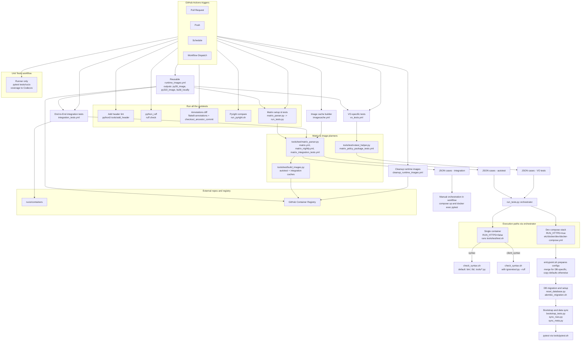

# Continuous Integration Pipelines

This document is the **source of truth** for Rucio’s CI. It explains how jobs are triggered, how runtime images and matrices are produced, how tests are orchestrated inside containers (or directly on runners), and which files wire everything together. A complete file inventory is provided at the end.

---

## At a glance

- **Workflows**
  - **Runtime image build** — reusable workflow providing Python runtime images to the rest of CI.
  - **Runtime image cache builder** — refreshes autotest/integration caches on GHCR.
  - **Runtime image cleanup** — prunes aged GHCR artefacts on a schedule or by hand.
  - **VO‑specific tests** — policy‑package suites executed in containers.
  - **End‑to‑End integration tests** — full compose stack, external services, targeted integration suites.
  - **Unit tests** — pure GitHub runner (no containers), coverage published to Codecov.
  - **Run all the autotests** — umbrella workflow: headers, style/quality, and the CI test matrix.

- **Shared building blocks**
  - **Reusable runtime images** built by `.github/workflows/runtime_images.yml` from `etc/docker/test/runtime.Dockerfile` + pinned `requirements/*`.
  - **Matrices** defined under `etc/docker/test/*.yml` and converted to JSON by `tools/test/matrix_parser.py` or constructed by `tools/test/votest_helper.py`.
  - **Image build planners** `tools/test/build_images.py` and `tools/test/donkeyrider.py` expand matrices into Docker build/run actions (the former drives cache refreshes, the latter underpins `tools/run_autotests.sh`).
  - **Orchestrator** `tools/test/run_tests.py` chooses between **single‑container** runs and the **dev docker‑compose** stack.
  - **Config overlays & Alembic**: `etc/docker/test/extra/*` merged or copied by `etc/docker/dev/rucio/entrypoint.sh` (details below).

---

## Reusable runtime images

**Workflow:** `.github/workflows/runtime_images.yml`

- Builds OCI images for **Python 3.9 and 3.10** from `etc/docker/test/runtime.Dockerfile`.  
- Image content is **content‑addressed**: a tag is derived from a SHA‑256 over `PYTHON`, the Dockerfile, and the two requirements lockfiles.  
- On success it publishes to **GHCR** and exposes three outputs:  
  `py39_image`, `py310_image`, and `build_locally` (to request local builds in downstream jobs when pulling is not possible).  
- The job first checks whether the resolved tag already exists on GHCR and skips rebuilding when it does. For pull requests that target `master`, it sets `build_locally=true` so downstream jobs build the image on the runner when the workflow cannot push to GHCR.
- Exposed as a reusable `workflow_call`, with manual `workflow_dispatch` support alongside the nightly cron, plus push triggers limited to the **`master`** branch when the Dockerfile or lockfiles change.

**Inputs & assets**  
- `etc/docker/test/runtime.Dockerfile`  
- `requirements/requirements.server.txt`  
- `requirements/requirements.dev.txt`

---

## Runtime image cache builder — `.github/workflows/imagecache.yml`

**Triggers:** weekday cron (03:00 UTC) and manual dispatch.

1. **setup** — checks out the tree and asks `tools/github/workflow/grabrelease.py` to enumerate release branches plus `master`.
2. **build_autotests** — iterates over the selected branches, parses `etc/docker/test/matrix.yml` via `tools/test/matrix_parser.py`, and feeds the resulting cases to `tools/test/build_images.py`. The helper pushes the refreshed images to `ghcr.io/<repo>/rucio-autotest:*` (and refreshes the local `rucio-dev-ci-runtime:py*` helpers); on scheduled runs it forces a fresh build so distro packages are updated. Non‑`master` branches exit early to avoid overwriting shared tags.
3. **build_integration_tests** — repeats the process for `etc/docker/test/matrix_integration_tests.yml`, checking out **`rucio/containers`** and the matching Rucio branch so the Docker build context is complete, before publishing the images under `ghcr.io/<repo>/rucio-integration-test:*` for the integration workflow to reuse.

The cache workflow operates purely through GHCR tags and the Docker BuildKit options emitted by `build_images.py`; no tests are executed here.

---

## Runtime image cleanup — `.github/workflows/cleanup_runtime_images.yml`

**Triggers:** cron (Sundays 02:00 UTC for untagged images, first of the month 03:00 UTC for tagged images) and manual dispatch with selectable cleanup mode.

- **cleanup-untagged** — calls the GitHub Container Registry API to delete untagged `rucio-dev-runtime` images older than 7 days.
- **cleanup-tagged** — performs the same sweep for tagged artefacts older than 30 days while explicitly preserving `*-buildcache` tags.

Both jobs authenticate with the Actions token and rely on the GitHub REST API + `jq` filtering to identify candidate image versions.

---

## Orchestration building blocks

### Matrices and parsers

- **General/autotest & integration**  
  `etc/docker/test/matrix.yml`, `matrix_nightly.yml`, `matrix_integration_tests.yml`  
  parsed by `tools/test/matrix_parser.py`. The parser normalises keys  
  `dists, python, suites, image_identifier, services` → `DIST, PYTHON, SUITE, IMAGE_IDENTIFIER, SERVICES`, expands `allow`/`deny` lists, and emits a JSON array consumed by GitHub Actions.

- **VO policy suites**
  `etc/docker/test/matrix_policy_package_tests.yml`
  consumed by `tools/test/votest_helper.py`, which validates VO sections, persists VO‑specific config overrides, and returns a matrix with the correct policy package, distro, Python, DB, and image identifier.

### Development stack & container entrypoint

- **Dev compose**: `etc/docker/dev/docker-compose.yml` runs a `rucio` (httpd) service and a `rucioclient` sidecar. During CI the `rucio` service image is overridden to the **runtime image** selected by the matrix. It also mounts identity provider secrets from `etc/docker/dev/rucio/idpsecrets.json`.
- **Entrypoint**: `etc/docker/dev/rucio/entrypoint.sh` prepares `rucio.cfg` and `alembic.ini` from `etc/docker/test/extra/`:
  - **Default (no `RDBMS`)** — copies `rucio_default.cfg` to `rucio.cfg` and `alembic_default.ini` to `alembic.ini` **without merging**.  
  - **DB‑specific branches** — merges `rucio_autotests_common.cfg` with the selected overlay (`rucio_postgres14.cfg`, `rucio_oracle.cfg`, `rucio_mysql8.cfg`, `rucio_sqlite.cfg`) via `tools/merge_rucio_configs.py`, and copies the matching Alembic file.

### Runners and helpers

- **Top‑level orchestrator**: `tools/test/run_tests.py`  
  - **RUN_HTTPD=true (default)** → bring up dev compose and `docker compose exec` into `rucio`.  
  - **RUN_HTTPD=false** → start a **single ephemeral container** and run `tools/test/test.sh` directly (used by syntax‑only jobs).  
  - Concurrency knobs (environment variables): `USE_PODMAN`, `PARALLEL_AUTOTESTS`, `PARALLEL_AUTOTESTS_PROCNUM`, `PARALLEL_AUTOTESTS_FAILFAST`.

- **Shell/Test entrypoints**  
  - `syntax` → runs `tools/test/check_syntax.sh` (Ruff) with its defaults (**bin/**, **lib/**, **tools/*.py**). Use `SYNTAX_RUFF_ARGS` to expand or narrow this set.  
  - `client_syntax` → runs the same checker but builds `SYNTAX_RUFF_ARGS` via `tools/test/ignoretool.py --ruff` and limits checks to CLI artefacts and client-specific tests.  
  - `client` → initialises the stack via `tools/run_tests.sh -i`, applies `rucio_client.cfg`, then runs client tests with `tools/pytest.sh`.  
  - `votest` → waits for the services, rewrites the policy section in `rucio.cfg` via `tools/test/votest_helper.py --vo-config`, and then executes the VO-specific test selection returned by the helper.  
  - Other suites reuse these helpers as required.  
  - `tools/pytest.sh` launches pytest (disables auto-plugins, enables `xdist` except on sqlite/mysql/oracle) and translates `/opt/rucio/tests/...` paths when running with mounted sources.  
  - `tools/run_multi_vo_tests_docker.sh` performs full **multi-VO** initialisation and (optionally) RSE activation.

- **DB/bootstrap/alembic & data**  
  `tools/reset_database.py`, `tools/alembic_migration.sh`, `tools/bootstrap_tests.py`, `tools/sync_rses.py` (uses `etc/rse_repository.json`), `tools/sync_meta.py`.  
  Multi‑VO configs like `etc/docker/test/extra/rucio_multi_vo_tst_postgres14.cfg` reference `/opt/rucio/etc/multi_vo/tst/etc/alembic.ini` inside the container.

---

## Workflows in detail

### VO‑specific tests — `.github/workflows/vo_tests.yml`

**Triggers:** PR, push, manual, nightly.

1. **runtime_images** — resolves image tags via the reusable workflow.  
2. **setup** — installs `PyYAML`, writes `branch` to `$GITHUB_OUTPUT` via `tools/github/workflow/set_branch_output_env.py`, and emits a JSON **matrix** by running `tools/test/votest_helper.py`.  
3. **test** — logs into GHCR; when `build_locally == 'true'` builds the image inside the job (using cache‑from); then streams a single matrix case into `tools/test/run_tests.py`.

**Suites & policy packages today:** **atlas**, **belleii** (both on AlmaLinux 9, Python 3.9, PostgreSQL 14).

---

### End‑to‑End integration tests — `.github/workflows/integration_tests.yml`

**Triggers:** PR, push, nightly.

1. **runtime_images** — resolves the **Python 3.9** runtime image.  
2. **setup** — installs `PyYAML`, computes `branch`, turns `etc/docker/test/matrix_integration_tests.yml` into a JSON matrix via `tools/test/matrix_parser.py`.  
3. **integration-tests** — checks out `rucio/containers` and the Rucio source, selects an appropriate containers tag, optionally builds the runtime image locally, pulls service images, **overrides the `rucio` service** to use the runtime image, and brings the stack up with the **storage, externalmetadata, iam** profiles **defined in the workflow**. Tests are then executed inside the running container(s), and the stack is torn down.

**Notes:** this workflow orchestrates Compose and pytest directly; it **does not** call `tools/test/run_tests.py`.

---

### Unit tests — `.github/workflows/unit_tests.yml`

**Triggers:** PR, push, nightly.

- Runs a **Python matrix** `3.9, 3.10, 3.11, 3.12` on `ubuntu-latest`.  
- Installs system deps (Kerberos, XMLSec), upgrades pip tooling, installs `requirements/requirements.dev.txt`, and executes `pytest tests/rucio --cov=lib/rucio`.  
- Publishes coverage with `codecov/codecov-action`.

---

### Run all the autotests — `.github/workflows/autotest.yml`

**Triggers:** PR, push, nightly.

Jobs:
1. **Add header lint** — `python3 tools/add_header --dry-run --disable-progress-bar` ensures new/changed files carry the standard header.
2. **python_ruff** — `ruff check --output-format=github .`.
3. **Check Python Type Annotations** — generates a report with `flake8-annotations` (via `tools/count_missing_type_annotations_utils.sh`), checks out the ancestor of `rucio/master` using the local action `.github/actions/checkout_ancestor_commit`, and fails the job if missing annotations **increased**. This job is skipped for scheduled runs and for release or tag builds.
4. **Python type check (Pyright)** — runs `tools/run_pyright.sh` against the current tree, compares the report with the ancestor of `rucio/master`, and fails on regressions. It follows the same scheduling and release/tag exclusions as the annotation check.
5. **Build Runtime Images** — reuses `.github/workflows/runtime_images.yml` to ensure GHCR tags exist (and builds locally when necessary); this step is skipped during the scheduled nightly run because the standalone runtime-image workflow already refreshed the tags.
6. **Matrix setup & tests** — installs prerequisites, computes the matrix (`etc/docker/test/matrix.yml` for PRs/pushes, or `matrix_nightly.yml` for scheduled runs), and executes each entry through `tools/test/run_tests.py`. Suites include `syntax`, `client_syntax`, `client`, `remote_dbs` (PostgreSQL 14, MySQL 8, Oracle), `sqlite`, and `multi_vo`.

---

## Container stack details (when `RUN_HTTPD=true`)

- **Image**: runtime image from the matrix (built or pulled).  
- **Compose**: `etc/docker/dev/docker-compose.yml` (the `rucio` service is overridden to use the runtime image and the working tree is mounted).  
- **Entrypoint**: generates `rucio.cfg` and `alembic.ini` from overlays and DB‑specific templates or copies defaults when `RDBMS` is unset; updates CA trust; symlinks `/usr/bin/python` if needed.  
- **Test flow**: suites such as `client`, `remote_dbs`, and `sqlite` rely on `tools/run_tests.sh` to reset databases, bootstrap data, and hand off to `tools/pytest.sh` (`xdist` disabled on sqlite/mysql/oracle). Only the `multi_vo` suite calls `tools/run_multi_vo_tests_docker.sh` before invoking pytest.

---

## Mermaid: CI architecture

---

## Environment variables of interest

- **Matrices / runners**: `SUITE`, `PYTHON`, `DIST`, `SERVICES`, `IMAGE_IDENTIFIER`, `POLICY` (VO policy cases).
- **Execution mode & DB**: `RUN_HTTPD` (default `true`), `RDBMS` (`postgres14`, `mysql8`, `oracle`, `sqlite`), `RUCIO_HOME`.
- **Runtime image selection**: `RUCIO_TAG`, `DOCKER_REPO`, `RUCIO_DEV_PREFIX`.
- **Orchestrator concurrency**: `USE_PODMAN`, `PARALLEL_AUTOTESTS`, `PARALLEL_AUTOTESTS_PROCNUM`, `PARALLEL_AUTOTESTS_FAILFAST`, `COPY_AUTOTEST_LOGS`.
- **Pytest behaviour**: `RUN_XDIST` (parallelism toggle).
- **Image reuse**: `RUCIO_AUTOTEST_REUSE_IMAGES` (skip rebuilding/pulling images when they already exist locally).

---

## Appendix — Complete inventory of CI/test files

**GitHub Actions (workflows)**  
- `.github/workflows/autotest.yml`
- `.github/workflows/unit_tests.yml`
- `.github/workflows/integration_tests.yml`
- `.github/workflows/vo_tests.yml`
- `.github/workflows/runtime_images.yml`
- `.github/workflows/imagecache.yml`
- `.github/workflows/cleanup_runtime_images.yml`

**Local GitHub actions**
- `.github/actions/checkout_ancestor_commit/` *(used by `autotest.yml`)*

**GitHub workflow helpers**
- `tools/github/workflow/grabrelease.py`
- `tools/github/workflow/set_branch_output_env.py`
- `tools/github/workflow/util.py`

**Runtime image build assets**
- `etc/docker/test/runtime.Dockerfile`
- `requirements/requirements.server.txt`
- `requirements/requirements.dev.txt`

**Development compose & entrypoint**  
- `etc/docker/dev/docker-compose.yml`  
- `etc/docker/dev/rucio/entrypoint.sh`  
- `etc/docker/dev/rucio/idpsecrets.json`

**Matrix descriptors**  
- `etc/docker/test/matrix.yml`  
- `etc/docker/test/matrix_nightly.yml`  
- `etc/docker/test/matrix_integration_tests.yml`  
- `etc/docker/test/matrix_policy_package_tests.yml`

**Config overlays & Alembic (consumed by entrypoint)**  
- `etc/docker/test/extra/rucio_autotests_common.cfg`  
- `etc/docker/test/extra/rucio_client.cfg`  
- `etc/docker/test/extra/rucio_default.cfg`  
- `etc/docker/test/extra/rucio_oracle.cfg`  
- `etc/docker/test/extra/rucio_mysql8.cfg`  
- `etc/docker/test/extra/rucio_sqlite.cfg`  
- `etc/docker/test/extra/rucio_postgres14.cfg`  
- `etc/docker/test/extra/alembic_default.ini`  
- `etc/docker/test/extra/alembic_oracle.ini`  
- `etc/docker/test/extra/alembic_mysql8.ini`  
- `etc/docker/test/extra/alembic_sqlite.ini`  
- `etc/docker/test/extra/alembic_postgres14.ini`  
- `etc/docker/test/extra/multi_vo/tst/etc/alembic.ini`  
- `alembic.ini.template`

**Runners, parsers & helpers**
- `tools/test/run_tests.py`
- `tools/test/test.sh`
- `tools/test/matrix_parser.py`
- `tools/test/votest_helper.py`
- `tools/test/build_images.py`
- `tools/test/donkeyrider.py`
- `tools/run_multi_vo_tests_docker.sh`
- `tools/pytest.sh`
- `tools/pytest.ini`
- `tools/run_tests.sh`  *(init helper invoked by `test.sh` for the client suite)*
- `tools/run_autotests.sh`
- `tools/test/check_syntax.sh`
- `tools/test/ignoretool.py`

**DB/bootstrap & test data**
- `tools/reset_database.py`
- `tools/alembic_migration.sh`  
- `tools/bootstrap_tests.py`  
- `tools/sync_rses.py`  
- `tools/sync_meta.py`  
- `tools/docker_activate_rses.sh`  
- `etc/rse_repository.json`  
- `etc/docker/test/extra/rucio_multi_vo_tst_postgres14.cfg`  
- `etc/docker/test/extra/rucio_multi_vo_ts2_postgres14.cfg`

**Quality & reporting**
- `tools/add_header`
- `tools/count_missing_type_annotations_utils.sh`
- `tools/count_missing_type_annotations.sh`  *(used via the local checkout action)*
- `tools/run_pyright.sh`
- `tools/run_pyright/`
- `tests/rucio/`  *(unit test subset)*
