Rucio developer toolbox
=======================

The developer toolbox builds a runtime from the current checkout and provides
one entry point for the workspace, canonical tests, debugging, profiling,
observability, and performance reports. It does not depend on a mutable
published development image.

Containers, networks, and volumes are checkout-scoped. Persistent workspace
runtime images are content-fingerprinted and can be reused by another checkout
with identical inputs. Locally built test runtime tags are checkout-scoped.
Matching builds can still reuse BuildKit layers. Host-side state can be created
below ``.venv``, ``.rucio-dev``, ``.autotest``, ``.test-logs``, and
``.pytest_cache``. Lifecycle commands do not remove unrelated Docker resources
or another checkout's state.

Chapters
--------

#. `Getting started <#developer-toolbox-getting-started>`__: prerequisites,
   first start, the workspace model, optional services, IDE orientation, and
   lifecycle commands.
#. `Testing <#developer-toolbox-testing>`__: Python environments and runtime
   construction, canonical cases, selectors, isolation, concurrency, and IDE
   actions.
#. `Debugging <#developer-toolbox-debugging>`__: breakpoint debugging in VS
   Code and PyCharm for tests, daemons, the API server, and Python commands.
#. `Profiling and observability <#developer-toolbox-profiling>`__: CPU, peak
   allocation, call statistics, container resources, Tempo, and Loki.
#. `Performance reports <#developer-toolbox-reports>`__: isolated PostgreSQL
   benchmarks, interpretation, and run-to-run comparisons.

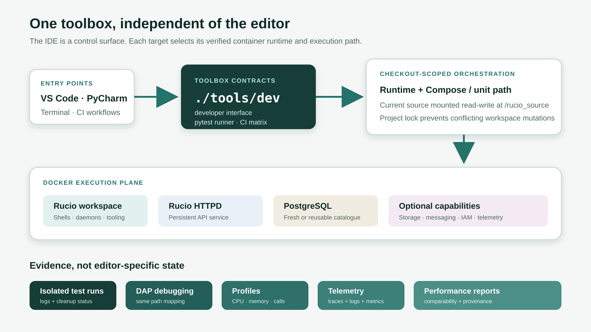

   VS Code and PyCharm are interchangeable control surfaces for
   ``./tools/dev``. CI consumes the same case model through the pytest runner.
   Each selected case or target determines its runtime and whether execution
   uses Compose or the unit-case container-only path.

.. _developer-toolbox-getting-started:

Getting started
---------------

Quick start
~~~~~~~~~~~

After installing the prerequisites below, start Docker and run these commands
from the repository root::

    ./tools/dev doctor
    ./tools/dev up
    ./tools/dev shell

The first start can take several minutes. Source files are bind-mounted at
``/rucio_source``. File changes are immediately visible in the container, but a
process that already imported a changed module must be stopped and relaunched.

Inspect or stop the environment with::

    ./tools/dev status
    ./tools/dev down

Use ``./tools/dev --help`` and the help for each subcommand for the complete
command-line reference.

Prerequisites
~~~~~~~~~~~~~

The supported host environments are Linux, macOS, and Windows through WSL2.
Native Windows is not supported. Install:

* Git;
* Python 3.9 or newer, including ``venv``;
* a running Docker daemon;
* Docker Compose 2.22.0 or newer (``docker compose``); and
* Docker Buildx (``docker buildx``).

Docker Desktop supplies the Docker components on macOS. On Windows, run the
toolbox inside a WSL2 distribution with Docker Desktop's WSL integration
enabled, and keep the checkout in the WSL filesystem rather than a mounted
Windows drive. Docker Engine with the Compose and Buildx plugins is sufficient
on Linux.

Toolbox commands pull public service and base images and install Python
packages while building runtimes. Keep network and registry access available,
including after the first run: dependency services are refreshed when an
environment starts. Registry authentication is normally unnecessary for the
public images, but local rate limits or an organisation mirror can require it.

Local-development security boundary
~~~~~~~~~~~~~~~~~~~~~~~~~~~~~~~~~~~

Use the toolbox only on a development host with a trusted checkout and
non-production data. It is not a production deployment or security boundary:

* ``./tools/dev``, host-side test orchestration, and editable installation run
  checkout code on the host, while Dockerfiles, entrypoints, and application
  targets execute on the developer's Docker daemon;
* the checkout is mounted read-write into the runtime;
* CPU profiling grants the profiled target container ``SYS_PTRACE`` and an
  unconfined seccomp profile for the duration of the target;
* DAP, the Flask development server, and Grafana bind to fixed loopback ports,
  while Grafana has no local authentication; and
* logs, telemetry, profiles, JUnit output, and reports can contain source
  paths, identifiers, request data, and captured application output.

Do not supply production credentials, tokens, certificates, message payloads,
or catalogues. Inspect every retained artifact before sharing it. Loopback
binding prevents remote network access; it does not isolate other processes
running as the same host user.

Clone and verify
~~~~~~~~~~~~~~~~

Clone your fork, add the upstream repository, and run the prerequisite checks::

    git clone git@github.com:<your-name>/rucio.git
    cd rucio
    git remote add upstream https://github.com/rucio/rucio.git
    ./tools/dev doctor

``doctor`` reports the Docker daemon, Compose, Buildx, checkout, and Python
environment checks independently. Resolve every ``failed`` result before
continuing. On first use it creates a toolbox-owned ``.venv``, installs the
checkout in editable mode with the constrained server and orchestration
dependencies, and refreshes that environment when its inputs change. This is
the indexing environment that makes imports such as SQLAlchemy available to an
IDE; application execution remains in Docker.

VS Code is already configured to use ``.venv/bin/python``. PyCharm normally
discovers the conventional project environment; if it prompts, select that
same interpreter. The toolbox recognises environments it owns by a marker and
never replaces a pre-existing or symlinked ``.venv``. When one exists, it is
left under developer control and the commands create a separate host-side
adapter at ``.rucio-dev/control-venv``. Maintain the existing ``.venv`` yourself
or move it aside and rerun ``doctor`` if you want the toolbox to manage the IDE
environment.

Start the workspace
~~~~~~~~~~~~~~~~~~~

Start the Rucio workspace and its PostgreSQL catalogue::

    ./tools/dev up

The command builds or reuses the Python 3.10 runtime for the Docker server
architecture, starts a checkout-scoped Compose project, installs the mounted
checkout in editable mode, verifies its dependencies, and initializes the
catalogue. A cold native image build can take several minutes. Source builds or
emulated architectures can take tens of minutes. Open a shell with::

    ./tools/dev shell

Use ``./tools/dev up --no-initialize`` only when the catalogue is already
prepared or the task deliberately needs services without catalogue
initialization.

The checkout is mounted at ``/rucio_source``. Source edits do not require an
image rebuild. Stop and rerun a foreground command to reload imported Python
modules. Restart the persistent workspace with ``./tools/dev down`` followed by
``./tools/dev up`` when its long-running process or configuration must reload.

The project keeps the always-on HTTPD API in the ``rucio`` service and runs
shells, daemons, debug targets, and profilers in a separate ``workspace``
service. Workspace clients use ``https://rucio:443`` on the Compose network,
so profiling a target does not also profile the persistent API process.

Run code normally
~~~~~~~~~~~~~~~~~

Use ``run`` for foreground application work that needs neither a debugger nor
a profiler. Each form starts or reuses the workspace before launching its
target::

    ./tools/dev run daemon hermes --run-once
    ./tools/dev run server
    ./tools/dev run command -- python -c \
        'from rucio.client import Client; print(Client().ping())'

``daemon`` accepts a Rucio daemon name and selects its required service
capabilities automatically. ``server`` starts a foreground Flask development
server on ``http://127.0.0.1:8080``; it is separate from the persistent HTTPD
API. ``command`` executes the exact command after ``--`` in the workspace.
Press **Ctrl+C** to stop a foreground target.

Persistent workspace runtime image names include a fingerprint of the
Dockerfile, requirements, certificates, entrypoint, Python version, target, and
platform. The fingerprint selects the local image identity. It does not make
upstream operating-system repositories reproducible, and it is independent of
branch names and mutable published development tags. BuildKit manages layer
reuse separately. Test image and cache semantics are described in `Cold builds,
cache, and image overrides
<#developer-toolbox-test-images>`__.

Optional service capabilities
~~~~~~~~~~~~~~~~~~~~~~~~~~~~~

The base workspace contains the Rucio API, execution workspace, and PostgreSQL.
Start additional capabilities only when the work needs them::

    ./tools/dev up --profile storage
    ./tools/dev up --profile messaging
    ./tools/dev up --profile externalmetadata
    ./tools/dev up --profile iam

Repeat ``--profile`` to combine capabilities. ``storage`` adds transfer and
test-RSE services, ``messaging`` adds ActiveMQ, ``externalmetadata`` adds the
metadata stores, and ``iam`` adds the identity services. Daemon commands select
their mapped capabilities automatically.

``shell`` and ``logs`` accept the same ``--profile`` and ``--ports`` options so
they can address the matching workspace composition.

Use ``--ports`` only when a host process must reach a dependency service. It
does not publish the persistent HTTPD API. Published toolbox ports bind to
``127.0.0.1``. DAP (5678), the Flask development server (8080), and Grafana
(3001) use fixed host-global ports, so only one checkout can own each at a time.
Every mapping enabled by ``--ports`` is host-global as well; do not enable
overlapping mappings in concurrent checkouts.
Observability workflows are covered in
`Profiling and observability <#developer-toolbox-profiling>`__.

.. _developer-toolbox-lifecycle:

Everyday lifecycle
~~~~~~~~~~~~~~~~~~

Run lifecycle commands from the checkout root::

    ./tools/dev status
    ./tools/dev logs
    ./tools/dev down
    ./tools/dev reset

``status`` lists only this checkout's services. ``logs`` follows the API and
execution-workspace containers. ``down`` stops the checkout-scoped project and
retains its volumes.
``reset`` also removes those volumes, including the catalogue and stored local
telemetry. Neither command removes another checkout's resources.

When troubleshooting, inspect ``status`` and ``logs`` before discarding data.
If clean state is necessary, run ``reset`` and then ``up``. Generated control
environments, test logs, profiles, and reports below ``.rucio-dev``,
``.test-logs``, or ``.autotest`` are ignored by Git and retained by ``reset``.
Delete a completed artifact directory only after confirming that no command is
using it. Docker may also retain content-fingerprinted runtime images and build
cache; inspect them with ``docker image ls`` and ``docker buildx du`` before
performing any manual, host-wide reclamation.

Stop the workspace before switching branches when a running process could see
an inconsistent source tree. Relaunch a process after changing code it has
already imported. The next start selects a new fingerprinted runtime after a
runtime input changes.

Editors
~~~~~~~

Open the checkout normally in VS Code or PyCharm; do not open a second
containerized IDE workspace. Shared VS Code tasks and PyCharm run configurations
call ``./tools/dev`` on the host, while execution remains in Docker.
On Windows, open the checkout through the IDE's WSL integration so these host
commands run inside the same distribution as the toolbox.

VS Code users should install the recommended workspace extensions when
prompted. PyCharm users need a version that supports the shared **Attach to
DAP** configuration. IDE-specific test and attachment steps are covered in `Testing
<#developer-toolbox-testing>`__ and `Debugging <#developer-toolbox-debugging>`__.

Environment troubleshooting
~~~~~~~~~~~~~~~~~~~~~~~~~~~

Start with ``./tools/dev doctor``, then ``./tools/dev status`` and
``./tools/dev logs``. Resolve the narrowest failure before resetting state:

.. list-table::
   :header-rows: 1
   :widths: 28 72

   * - Symptom
     - Action
   * - Compose or Buildx check fails
     - Upgrade the Docker components; Compose 2.22.0 is the minimum supported
       version. Confirm that the same shell can reach the running daemon.
   * - Pull or build fails
     - Check registry access, proxy configuration, available disk space, and
       organisation mirror credentials. The toolbox needs network access after
       the first run because dependency images are refreshed.
   * - Port 5678, 8080, 3001, or a ``--ports`` mapping is busy
     - Stop the older debug, Flask, or observe target. Remember that
       ``status`` shows only the current checkout; another checkout or host
       process can own the requested mapping.
   * - ``workspace is busy``
     - Finish or interrupt the active ``./tools/dev`` workspace command. Do not
       delete ``.rucio-dev/workspace.lock`` to bypass a live owner.
   * - Containers are stale after an interrupt
     - Run ``./tools/dev down`` and retry. Use ``reset`` only when catalogue and
       telemetry data can be discarded; never use host-wide Docker cleanup as
       a toolbox recovery step.
   * - Docker becomes slow or runs out of memory
     - Stop concurrent cases and other Rucio checkouts, reduce
       ``--case-workers`` or ``--xdist-workers``, and review Docker CPU, memory,
       and disk allocation. Emulated ``linux/amd64`` cases need additional
       resources on ARM64.

.. _developer-toolbox-testing:

Testing
-------

Canonical matrix
~~~~~~~~~~~~~~~~

List the canonical CI cases and supported Python versions::

    ./tools/dev test --list

A canonical case fixes the Python version, database, suite, policy, and service
capabilities. Only IDs printed by this checkout's ``--list`` output can be
passed as positional case selectors. Suite axis options select subsets of the
same matrix. The matrix is organised as follows:

.. list-table::
   :header-rows: 1
   :widths: 16 17 23 44

   * - Suite
     - Python
     - Database or policy
     - Purpose
   * - ``unit``
     - 3.9--3.13
     - none
     - Unit and test-infrastructure checks in the unit image.
   * - ``client``
     - 3.9--3.13
     - PostgreSQL 14
     - Client and command-line tests.
   * - ``remote_dbs``
     - 3.9--3.13
     - PostgreSQL 14 and Oracle
     - Server autotests against each supported test database.
   * - ``multi_vo``
     - 3.9--3.13
     - PostgreSQL 14
     - Two sequential VO legs using the same case environment.
   * - ``votest``
     - 3.9--3.13
     - ATLAS and Belle II
     - Policy-package test selections, one case per Python and policy.
   * - ``integration``
     - 3.9--3.13
     - PostgreSQL 14
     - Storage, external-metadata, IAM, and transfer integration topology.

PostgreSQL Rucio runtimes use the Docker server's native architecture. Oracle
runtimes and services, the integration FTS and some IAM services, and the
workspace ``messaging`` ActiveMQ use ``linux/amd64``. General test dependencies
otherwise use the Docker server architecture.
Docker Desktop supplies emulation for compatible AMD64 images on Apple Silicon.
ARM64 Linux hosts need binfmt/QEMU configured, and emulated cases can be much
slower.

The pinned Oracle XE 18.4 image does not support Apple Silicon Docker Desktop.
Run Oracle cases on a compatible x86_64 Docker host. The ``remote_dbs`` suite
and ``all`` include Oracle, so select PostgreSQL explicitly on Apple Silicon::

    ./tools/dev test --python 3.13 --rdbms postgres14 remote_dbs

There is no ``all except Oracle`` selector. Run the remaining suite names
individually when validating every non-Oracle topology on that platform.

Python environments and runtime construction
~~~~~~~~~~~~~~~~~~~~~~~~~~~~~~~~~~~~~~~~~~~~

The toolbox uses separate Python environments for host orchestration,
development work, and tests. Selecting a test Python does not modify the host
environment or the persistent workspace.

.. list-table::
   :header-rows: 1
   :widths: 20 22 58

   * - Context
     - Python
     - Preparation and purpose
   * - Host controller and IDE
     - Host Python 3.9 or newer
     - ``doctor`` creates a managed ``.venv`` with the editable checkout for
       orchestration and IDE indexing when possible. If ``.venv`` is unmanaged,
       ``.rucio-dev/control-venv`` receives only the orchestration dependencies
       and IDE setup remains under developer control. Application execution
       remains in Docker.
   * - Persistent workspace
     - Python 3.10
     - ``up``, ``shell``, ``run``, ``observe``, and non-test debug and profile
       commands use the content-fingerprinted AlmaLinux 10 runtime. They do not
       accept the test ``--python`` axis.
   * - Unit case
     - Selected case minor
     - Buildx starts from ``python:<minor>-slim-bookworm`` and installs the
       development and test requirements. Unit cases do not start Compose.
   * - Service-backed case
     - Selected case minor
     - Buildx creates an AlmaLinux runtime for the database target. Compose
       profiles start the database and other required service capabilities. The
       checkout is mounted and installed editable after Compose starts.
   * - Test debug or profile
     - Selected case minor
     - ``debug test`` and ``profile <kind> test`` use the same effective case
       construction as ``test``.
   * - Performance report
     - Python 3.10
     - The report command uses the fixed PostgreSQL performance case so baseline
       and candidate runs share one runtime contract.

Unit images use the current patch release resolved by the official
``python:<minor>-slim-bookworm`` tag. Service-backed Python 3.9 through 3.13
uses exact checksum-verified CPython source releases on AlmaLinux 10. The
current pins are 3.9.25, 3.10.20, 3.11.15, 3.12.13, and 3.13.14. The Dockerfile
is the source of truth when these patch releases change. Python 3.9 is
source-built on AlmaLinux 10 to preserve the inherited test axis. This change
does not make a new upstream support claim.

For the source-built runtimes, the build creates ``/opt/venv``, compiles
Boost.Python and the pinned ``gfal2-python`` binding for the selected
interpreter, and compiles the pinned ``mod_wsgi`` 5.0.2 release against that
interpreter. It then
installs the constrained server, development, and toolbox requirements. The
Oracle target adds the Oracle client and is always built for ``linux/amd64``.
AlmaLinux's ``/usr/bin/python`` command remains bound to its system Python 3.12.
GFAL utility scripts use that interpreter with the distribution
``gfal2_util`` package. Rucio code uses the selected virtual environment and
its compiled GFAL binding.
These are normal GIL-enabled CPython builds, not free-threaded ``python3.13t``
builds. A successful build and selected test run validate only the exercised
combination. They do not claim broader upstream support for every native
dependency or deployment.

Application source is not baked into these runtime layers. Every case mounts
the current checkout at ``/rucio_source``. Service-backed cases install it
editable after startup. Unit cases run from the mounted checkout with
``PYTHONPATH=/rucio_source/lib``. Source-only changes therefore do not require
a runtime rebuild. Changes to inputs used by the selected image invalidate the
corresponding cached layers. Python, target, and platform affect the selected
or built runtime and can trigger a build.

.. _developer-toolbox-test-images:

Cold builds, cache, and image overrides
~~~~~~~~~~~~~~~~~~~~~~~~~~~~~~~~~~~~~~~

No manually prepared image is required on a fresh host. By default, unit and
service-backed test commands issue a local Buildx build. A cold Python 3.9
through 3.13 service runtime compiles CPython, Boost.Python, ``gfal2-python``,
and ``mod_wsgi``. It can take tens of minutes and use substantial Docker disk,
especially with architecture emulation. Later builds normally reuse BuildKit
layers.

Persistent workspace image tags contain a shortened runtime-input fingerprint.
The full fingerprint is stored in an image label and verified before reuse.
Identical runtime inputs can share the same workspace image. Default locally
built test image tags contain the checkout-path fingerprint and runtime name.
Another checkout receives another tag, although matching BuildKit layers remain
reusable.
``down`` and ``reset`` do not remove runtime images or BuildKit cache. Inspect
``docker image ls`` and ``docker buildx du`` before any targeted reclamation.

Ordinary local runs should leave test image overrides unset so the selected
runtime is built from the checkout. CI and advanced local workflows can supply
a prebuilt service runtime. Resolution uses the runtime-specific variable
first, then the global fallback, then a local build. Examples include::

    export RUCIO_TEST_IMAGE_PY313=registry.example/rucio-runtime:py313
    export RUCIO_TEST_IMAGE_PY313_ORACLE=registry.example/rucio-runtime:py313-oracle
    export RUCIO_TEST_IMAGE=registry.example/rucio-runtime:single-runtime

Unit cases always build their unit image and ignore these service-runtime
overrides. A multi-runtime selection cannot use only the global fallback. It
must provide one ``RUCIO_TEST_IMAGE_<RUNTIME>`` value for every selected runtime
or leave the global override unset so missing runtimes build locally. The inner
runner rejects an image whose observed Python minor does not match the case.

Canonical CI workflows may inject content-keyed prebuilt images to avoid a cold
build. A service case builds locally whenever no explicit matching image is
supplied.

Python selection
~~~~~~~~~~~~~~~~

Every suite in the canonical matrix covers Python 3.9, 3.10, 3.11, 3.12, and
3.13. A suite run can select one of these versions. Place toolbox axis options
before the positional suite name.

.. code-block:: console

    ./tools/dev test --python 3.13 --rdbms postgres14 remote_dbs -- \
        tests/test_ping.py::test_rucio_ping_rest

This selects the canonical case ``remote-dbs-py313-postgres14``. It keeps the
suite paths and service profiles while building the runtime with Python 3.13.
The same case can be selected directly::

    ./tools/dev test remote-dbs-py313-postgres14 -- \
        tests/test_ping.py::test_rucio_ping_rest

Omit ``--rdbms`` to run every database configured for the suite. Use
``--policy`` to select one policy. Run every suite topology with one Python
version as follows.

.. code-block:: console

    ./tools/dev test --python 3.13 all

The ``--python``, ``--rdbms``, and ``--policy`` axes require a positional suite
name. They refine a suite and cannot modify a canonical case ID. ``--rdbms``
and ``--policy`` cannot be combined with ``all``. Test debugging and profiling
must resolve the suite and axes to exactly one effective case.

Explicit pytest paths and node IDs after the suite replace its default paths,
then suite membership is applied during collection. They can narrow a run but
cannot add tests outside the selected suite.

Running ``./tools/dev test`` without a case opens a numbered chooser in an
interactive terminal. In a non-interactive terminal it prints the case list and
exits.

How suites select tests
~~~~~~~~~~~~~~~~~~~~~~~

Suite membership is configuration-driven. A test does not join a suite merely
because of a pytest marker or its Python version. The definitions in
``tests/ruciopytest/profiles.py`` select paths, exclusions, databases, policies,
and service capabilities.

.. list-table::
   :header-rows: 1
   :widths: 18 42 40

   * - Suite
     - Selection
     - Execution detail
   * - ``unit``
     - ``tests/rucio`` and ``tests/ruciopytest``
     - Runs in the unit image without Compose or a database.
   * - ``client``
     - ``tests/test_clients.py``, ``tests/test_bin_rucio.py``, and
       ``tests/test_module_import.py``
     - Uses the configured PostgreSQL client topology.
   * - ``remote_dbs``
     - The general ``tests`` tree, excluding ``tests/ruciopytest``
     - Repeats the server suite for each selected database.
   * - ``multi_vo``
     - The general ``tests`` tree, excluding ``tests/ruciopytest``
     - Runs the ``tst`` and ``ts2`` legs sequentially in one case environment.
   * - ``votest``
     - Paths selected by
       ``etc/docker/test/matrix_policy_package_tests.yml``
     - Resolves the selected ATLAS or Belle II policy package before collection.
   * - ``integration``
     - The explicit selector list in ``tests/ruciopytest/profiles.py``
     - Runs selectors sequentially in one prepared integration topology and
       retains its catalogue between sessions.

When changing a suite with explicit selectors or policy allow and deny lists,
update its profile or policy matrix and the related runner tests. Reuse the
existing suite unless the required infrastructure or lifecycle is genuinely
different.

Run one test
~~~~~~~~~~~~

For a first end-to-end check, use the smallest unit case. It verifies runtime
construction and pytest execution without starting Compose or a database::

    ./tools/dev test unit-py310 -- \
        tests/ruciopytest/test_infra_manager.py::test_initialized_database_uses_configured_schema

Elapsed time depends on whether the image is already built and on Docker's CPU,
memory, disk, and registry access. Unit cases use the Bookworm unit image. A
cold service-backed case source-builds its AlmaLinux 10 runtime and can take tens
of minutes before pytest starts. A complete database case also adds service and
catalogue setup time.

Pass a pytest path or node ID after the case::

    ./tools/dev test remote-dbs-py310-postgres14 \
        tests/test_ping.py::test_rucio_ping_rest

Module paths, class node IDs, ``-k`` expressions, ``-x``, coverage options, and
other pytest arguments are forwarded. An explicit ``--`` can make the boundary
clear::

    ./tools/dev test remote-dbs-py310-postgres14 -- \
        -x -k ping tests/test_ping.py

Toolbox options belong before the case. For example::

    ./tools/dev test --xdist-workers 1 remote-dbs-py310-postgres14 \
        tests/test_ping.py::test_rucio_ping_rest

For a database-backed case, the toolbox builds or reuses the matching runtime,
creates an isolated Compose project, initializes its catalogue, runs pytest,
captures service logs, and removes that project's containers, network, and
volumes. Unit cases use an ephemeral ``docker run --rm`` container and have no
Compose project, catalogue, or Apache log. Every case mounts the current
checkout, including uncommitted changes.

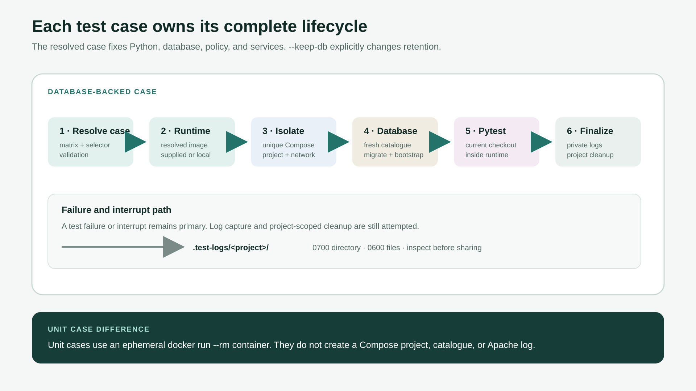

   Database-backed cases own their infrastructure from creation through
   cleanup. Unit cases deliberately take a smaller container-only path. Fresh
   database state is the default; ``--keep-db`` explicitly changes database
   retention for a local loop.

Run a complete case or suite
~~~~~~~~~~~~~~~~~~~~~~~~~~~~

Run the complete Python 3.10 PostgreSQL autotest case with::

    ./tools/dev test remote-dbs-py310-postgres14

This is one CI matrix case, not every Rucio test configuration. Run all cases in
a suite by using its suite name::

    ./tools/dev test unit
    ./tools/dev test client
    ./tools/dev test remote_dbs
    ./tools/dev test multi_vo
    ./tools/dev test votest
    ./tools/dev test integration

``remote_dbs`` includes PostgreSQL and Oracle. ``votest`` includes both policy
packages. ``multi_vo`` runs one case for each supported Python minor, and each
case owns its two VO legs. Run the entire canonical matrix with::

    ./tools/dev test all

Independent matrix cases can run concurrently::

    ./tools/dev test --case-workers 3 all

``--case-workers`` controls concurrent cases in a suite. ``--xdist-workers``
controls pytest workers inside cases that support xdist. Keep case concurrency
at one for interactive work and controlled measurements.

CI inheritance and maintainer contract
~~~~~~~~~~~~~~~~~~~~~~~~~~~~~~~~~~~~~~

Toolbox CI preserves the checked-out upstream parent's triggers, jobs, supported
Python and database axes, test selectors, and postconditions. The MySQL and
SQLite cases recorded under ``intentional_case_exclusions`` in
``.github/upstream-ci-contract.json`` are the only permitted reductions. Other
inherited selections must not be narrowed or masked with a skip, deselection,
expected failure, or ``continue-on-error``. Every retained check must remain
enabled and pass.

The minimum case IDs and selectors are asserted in
``tests/ruciopytest/test_profiles.py``. The protected upstream workflow, matrix,
and runner blobs are recorded in ``.github/upstream-ci-contract.json``. A rebase
which changes one of those parent blobs must stop validation. Audit the upstream
change against the case and workflow tests before refreshing the recorded blob
IDs. Do not refresh them merely to make validation pass.

The inherited unit minimum covers ``tests/rucio`` on Python 3.9 through 3.12.
The retained regular matrix covers client, PostgreSQL and Oracle remote
database, and multi-VO cases on Python 3.9 and 3.10.
The VO policy selections and all integration selectors and postconditions are
also minimums. The toolbox expands every remaining suite to Python 3.9 through
3.13. Those additional combinations and the toolbox self-tests are additive.

Xdist defaults are context-sensitive. Xdist-capable service-backed cases use
pytest's automatic worker count locally. GitHub Actions currently uses three
workers. Unit cases default to one pytest process. Set ``--xdist-workers 3``
when reproducing the current CI concurrency, or ``--xdist-workers 0`` for one
pytest process. Oracle and integration cases are configured to run serially.

The runner forwards repository pytest defaults and the invoking shell's
``PYTEST_ADDOPTS`` into the container. Inspect or unset ``PYTEST_ADDOPTS`` when
an exact CI-like command must not inherit personal pytest options::

    unset PYTEST_ADDOPTS
    ./tools/dev test --xdist-workers 3 remote-dbs-py310-postgres14

``./tools/dev`` is the supported developer interface. Workflow maintainers may
invoke the pytest plugin directly. ``python -bb -m pytest --list-cases`` emits
the canonical JSON matrix used by CI. Direct ``--case`` accepts canonical IDs
only. ``--dry-run`` and ``--dry-run-json`` resolve a selection without starting
Docker, and ``--container-env`` injects an explicit variable into the test
container. Treat these as CI and runner-maintenance contracts rather than an
alternative everyday interface.

Database lifetime
~~~~~~~~~~~~~~~~~

Fresh database state is the default. It keeps runs deterministic and prevents
one session from contaminating the next. During a tight local loop, reuse the
database volume for the same checkout and schema fingerprint with::

    ./tools/dev test --keep-db remote-dbs-py310-postgres14 \
        tests/test_ping.py::test_rucio_ping_rest

Do not use ``--keep-db`` for isolation-sensitive validation or performance
reports. A reusable project is locked against concurrent writers. Schema
changes select a different reusable volume automatically. This reuse applies
to service databases backed by named volumes.

Failures and logs
~~~~~~~~~~~~~~~~~

One case streams pytest output to the terminal. Concurrent runs also retain case
output below ``.test-logs``. Database-backed cases capture Compose and Apache
error logs before cleanup; unit cases retain only their case output. Log
directories are mode 0700 and files are mode 0600, but they can still contain
sensitive test output and are not removed by ``down`` or ``reset``.

Start with the failing node ID and its case log, then rerun without
``--keep-db`` before treating the failure as reproducible. The toolbox returns
pytest's nonzero status and still attempts project-scoped cleanup on failures
and interrupts. A cleanup error names the exact Compose project; it never
authorises global Docker cleanup.

Delete a completed project directory below ``.test-logs`` only when no matching
test command is running. Before sharing a log, inspect it for credentials,
tokens, local paths, identifiers, and application payloads.

IDE test actions
~~~~~~~~~~~~~~~~

In VS Code, run **Rucio: Test** from **Tasks: Run Test Task** and enter a case
and optional selector. Use **Rucio: Full PostgreSQL test** for the complete
``remote-dbs-py310-postgres14`` case.

PyCharm provides shared run configurations with the same names and defaults.
Its terminal prompts read one line per value and forward that line as one exact
argument; quotes and shell metacharacters are not evaluated. Press **Enter** to
accept a displayed default. Use the terminal command when a pytest invocation
needs several separate options. Both IDEs invoke ``./tools/dev``; they do not
run a second IDE-managed pytest environment. The separate performance-report
actions are documented in `Performance reports
<#developer-toolbox-reports>`__.

.. _developer-toolbox-debugging:

Debugging
---------

Attachment model
~~~~~~~~~~~~~~~~

The toolbox starts the target under ``debugpy`` inside the Rucio runtime,
publishes Debug Adapter Protocol (DAP) port 5678 on ``127.0.0.1``, and waits
before user code runs. The checkout is mounted at ``/rucio_source``, so an IDE
uses this mapping::

    local checkout root  ->  /rucio_source

The terminal reports both phases::

    Rucio debugger starting
    Rucio debugger ready on 127.0.0.1:5678

Attach after the second line. The loopback binding prevents a remote host from
connecting; do not replace it with an external interface on an untrusted
network. Port 5678 is fixed and host-global; only one checkout can own a debug
target at a time.

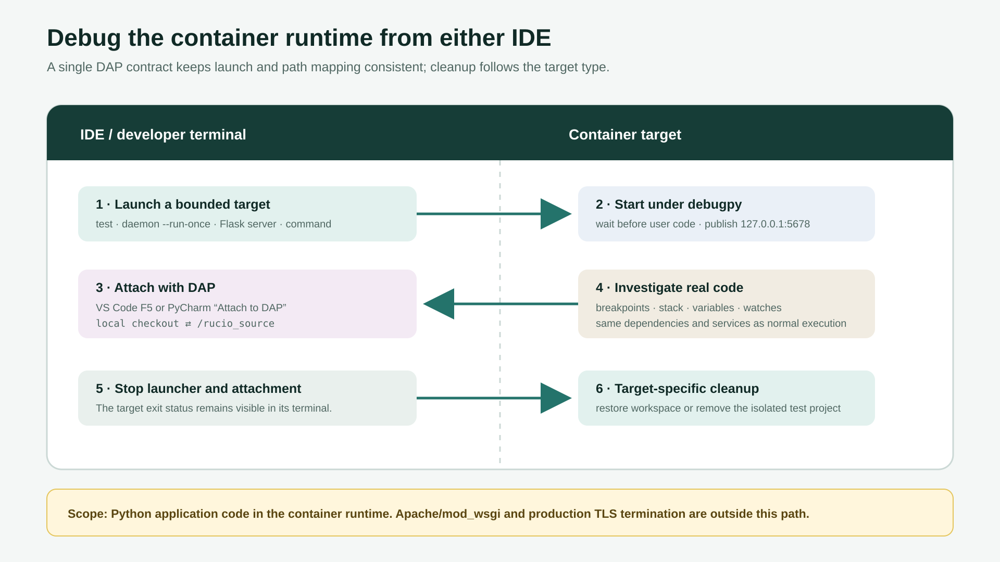

   The launcher and attachment are separate processes. Stop both when the
   session ends. Workspace targets restore the base workspace; isolated test
   targets clean up their complete test project.

Debug one test
~~~~~~~~~~~~~~

For a first application breakpoint, use ``Ping.get`` in
``lib/rucio/web/rest/flaskapi/v1/ping.py``, then start its REST test::

    ./tools/dev debug test remote-dbs-py310-postgres14 \
        tests/test_ping.py::test_rucio_ping_rest

To debug the same topology with Python 3.13, put the axes before the suite::

    ./tools/dev debug test --python 3.13 --rdbms postgres14 remote_dbs \
        tests/test_ping.py::test_rucio_ping_rest

The database-backed debug path disables xdist, creates fresh database state,
and performs normal case cleanup when the target exits. A unit debug case uses
the unit container path described in `Testing <#developer-toolbox-testing>`__.

VS Code
^^^^^^^

Press **F5**, choose **Rucio: Debug test**, and enter the case plus an optional
pytest selector. Its background task starts the command, waits for the exact
readiness message, attaches to port 5678, and applies the source mapping. The
usual Breakpoints, Call Stack, Variables, Watch, and Debug Console views then
operate on the container process.

If a target was started separately in a terminal, choose **Rucio: Attach to
5678** instead. When finished, stop both the debug session and any background
task that launched the target.

PyCharm
^^^^^^^

Start the shared **Rucio: Debug test** shell configuration and answer its case
and selector prompts. After the readiness line appears, start **Rucio: Attach
to DAP** in Debug mode. The shared attachment contains:

* remote address ``127.0.0.1:5678``;
* local root ``$PROJECT_DIR$``; and
* remote root ``/rucio_source``.

If the attachment type is unavailable, update to a PyCharm release documented
to support `Attach to DAP
<https://www.jetbrains.com/help/pycharm/run-debug-configuration-attach-to-dap.html>`_.
This DAP session uses debugpy. Breakpoints, stepping, stacks, watches, and
ordinary variable inspection are available, while some PyCharm-specific Python
debugger renderers are not. Stop the attachment and the separate shell run
configuration when finished.

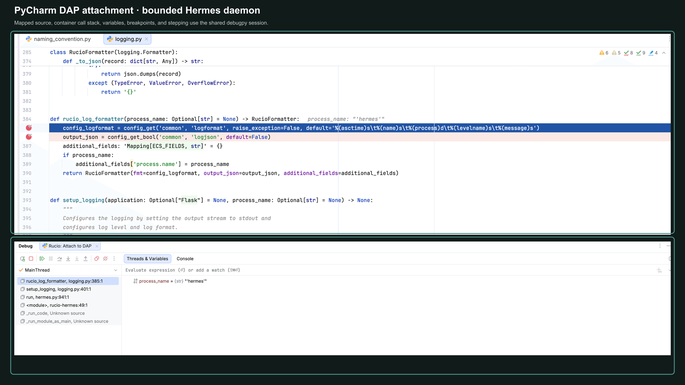

   A genuine bounded Hermes attachment. The highlighted source line, mapped
   container frames, variable inspection, and stepping controls are provided by
   the shared DAP configuration. This image demonstrates the attachment UI;
   choose a domain-method breakpoint for an investigation.

Debug a daemon
~~~~~~~~~~~~~~

Pass a daemon name with or without the ``rucio-`` prefix::

    ./tools/dev debug daemon hermes --run-once

The toolbox selects the daemon's mapped service capabilities before it starts.
For example, submitters, pollers, and reapers receive storage; the conveyor
receiver and Hermes receive messaging. Database-only daemons start neither.
Prefer a bounded option such as ``--run-once`` so one debug session has a clear
end.

Use **Rucio: Debug daemon** in either IDE, or start the command in a terminal
and use the attach-only configuration. The VS Code client requests subprocess
debugging. When investigating process creation, place an early breakpoint in
the parent because child attachment depends on client and target support.

Debug the development API server
~~~~~~~~~~~~~~~~~~~~~~~~~~~~~~~~

Start the Flask development server under debugpy::

    ./tools/dev debug server

After attachment, send requests to ``http://127.0.0.1:8080`` from another
terminal. This target is for Rucio application code. It does not reproduce
Apache, TLS termination, or other deployment web-server behavior; the toolbox
does not currently expose a supported Apache debug command.

Debug a Python command
~~~~~~~~~~~~~~~~~~~~~~

The command target accepts a Python module or script::

    ./tools/dev debug command -- python -m tools.merge_rucio_configs --help
    ./tools/dev debug command -- python tools/convert_database_vo.py --help

Arguments after the module or script are passed through unchanged. Use the
dedicated test or daemon target when one exists because it supplies the
appropriate isolation and service mapping.

Stopping and troubleshooting
~~~~~~~~~~~~~~~~~~~~~~~~~~~~

For a terminal-launched target, press **Ctrl+C** and allow the project-scoped
cleanup to finish. Disconnecting an IDE does not guarantee that its launcher
task also stopped; terminate that task before starting another debug target.
After a workspace target exits or is interrupted, the toolbox recreates the
base workspace without the DAP, API, or profiler overlay. Optional dependency
and observability services remain available until ``down``.

If a breakpoint remains hollow, verify that the IDE opened the same checkout
that launched the command and that the remote root is exactly
``/rucio_source``. If port 5678 is busy, stop the older task and inspect
``./tools/dev status``. If the target exits before readiness, diagnose the
terminal error first: its database or dependency startup failed before debugpy
could listen.

Avoid ``--pdb`` in a DAP run. It competes for terminal input and does not expose
IDE breakpoint state. Use a normal test command when terminal-only post-mortem
debugging is specifically required.

.. _developer-toolbox-profiling:

Profiling and observability
---------------------------

Choose a measurement
~~~~~~~~~~~~~~~~~~~~

Use the narrowest view that answers the question:

.. list-table::
   :header-rows: 1
   :widths: 16 46 38

   * - Mode
     - Measures
     - Primary output
   * - ``cpu``
     - Statistical samples from Python and subprocess stacks
     - ``cpu.svg`` flame graph
   * - ``memory``
     - Python allocations contributing to peak captured memory
     - ``memory.html`` Memray flame graph
   * - ``calls``
     - Thread-aware Python call counts and CPU time
     - ``calls.html`` and ``calls.pstats``
   * - ``resources``
     - Docker container CPU, memory, network, block I/O, and process trends
     - ``resources.html`` and ``docker-stats.jsonl``
   * - ``observe``
     - Instrumented operation latency and correlated logs; metrics when emitted
     - Tempo, Loki, and Prometheus in local Grafana

Every ``profile`` mode also samples the containers in its target execution
project. Workspace targets include the persistent HTTPD API when it is running;
database-backed tests sample their isolated test project, and unit tests sample
the labelled ephemeral unit container. Test sampling wraps the canonical pytest
process. It therefore includes database reset, migrations, bootstrap, fixtures,
and tests, but excludes runtime image builds, dependency pulls, and service
startup. The command prints an
``index.html`` URI for the completed artifact; each run is stored in a private
timestamped directory below
``.rucio-dev/artifacts``. ``./tools/dev reset`` does not remove completed
artifacts. Profiles can contain paths, source symbols, arguments, and workload
data. Inspect them before sharing, and delete an old run directory only when no
profile command is using it. `Find a completed result
<#developer-toolbox-latest-result>`__ documents the shared latest-result
locator.

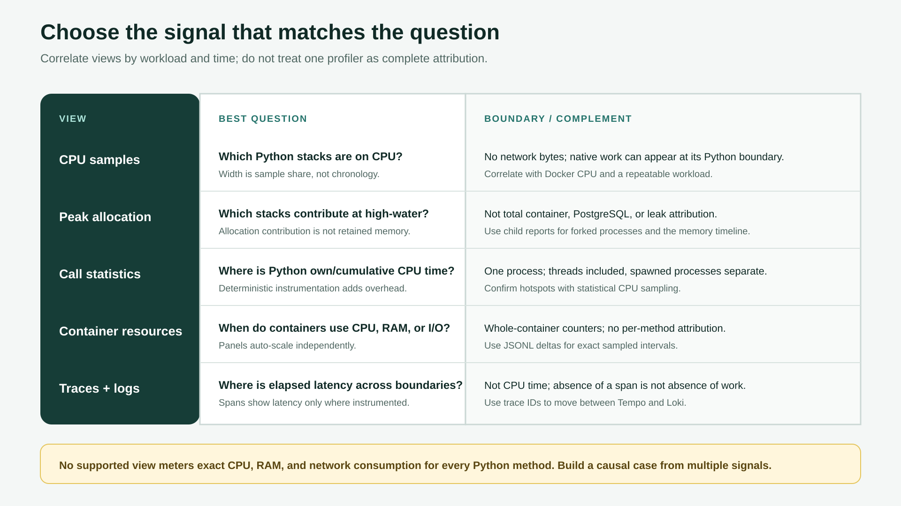

   Start with a question, not a tool. Correlate multiple signals when an
   investigation crosses Python, containers, and services.

Profile one test
~~~~~~~~~~~~~~~~

Use the same case and node ID as a normal test. For CPU samples::

    ./tools/dev profile cpu test remote-dbs-py310-postgres14 \
        tests/test_ping.py::test_rucio_ping_rest

When investigating blocked Python threads, request a separate idle-inclusive
capture. The option must appear before the target::

    ./tools/dev profile cpu --idle test remote-dbs-py310-postgres14 \
        tests/test_download.py::test_overlapping_containers_and_wildcards

``--idle`` is accepted only for CPU profiles. It includes sleeping thread
stacks and is useful when a focused workload appears to wait on I/O, locks, or
worker results. It can make idle workers dominate the graph and it does not
capture an existing service process which is outside the profiled process
tree. Keep the default active-only capture for ordinary CPU hotspot searches.

Select Python 3.13 and PostgreSQL before the suite when profiling an effective
local case::

    ./tools/dev profile cpu test --python 3.13 --rdbms postgres14 remote_dbs \
        tests/test_ping.py::test_rucio_ping_rest

Open ``cpu.svg``. Each rectangle is a stack frame, and its width is proportional
to the number of samples containing that frame, not elapsed chronology. Colour
is non-semantic. Read from an entry point toward its callees. A wide leaf is a
direct hotspot; a wide parent divided among children points to work spread
across those calls. Native work can appear at its Python boundary. Search for a
function name and repeat the same controlled workload before drawing a
conclusion from a short run.

Use the **Search** control in the upper-right corner when narrow frames hide
their labels. Its white background keeps it visible over a long profile title.
It accepts regular expressions and highlights every match. Click a highlighted
frame to expand its stack, then hover over frames for the complete function,
source line, sample count, and percentage.

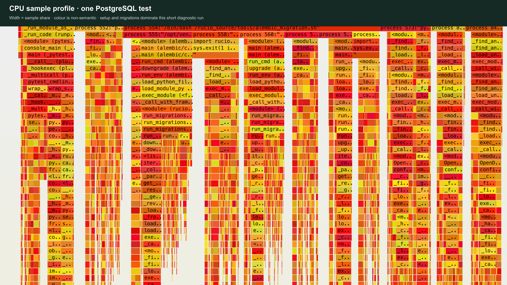

   A static 4K crop from a genuine single-test capture. Its wide migration and
   test-setup stacks show that setup can dominate a short test. This is a
   diagnostic example, not a performance baseline; the generated ``cpu.svg``
   remains interactive.

For a peak-allocation view::

    ./tools/dev profile memory test remote-dbs-py310-postgres14 \
        tests/test_ping.py::test_rucio_ping_rest

Open ``memory.html`` for the parent process. When the workload forks, Memray
creates separate captures and the toolbox renders each as
``memory-fork-<pid>.html``. Each flame graph attributes bytes that contributed
to that process's high-water mark to Python allocation stacks. A wide frame
therefore identifies an important contributor at peak, not exact memory
retained after the test, total allocation churn, native stack memory, or a
proven leak. Confirm suspected growth with repeatable longer workloads and the
container memory timeline.

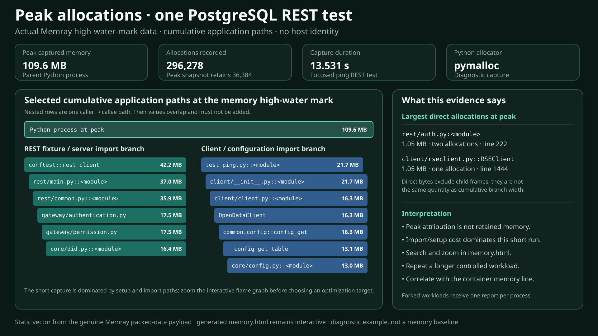

   A static vector rendering of genuine Memray report data. It highlights
   cumulative application paths and direct allocations at the high-water mark;
   open the generated ``memory.html`` to search and zoom the complete capture.
   This is a diagnostic example, not a memory baseline.

For deterministic call statistics::

    ./tools/dev profile calls test remote-dbs-py310-postgres14 \
        tests/test_ping.py::test_rucio_ping_rest

The calls mode uses Yappi's CPU clock and profiles all Python threads in the
target process. Open ``calls.html`` and compare **own time**, which excludes
callees, with **cumulative time**, which includes them. High cumulative time
with low own time points to expensive descendants. Instrumentation changes the
workload, so use the statistical CPU profile to confirm a hotspot.

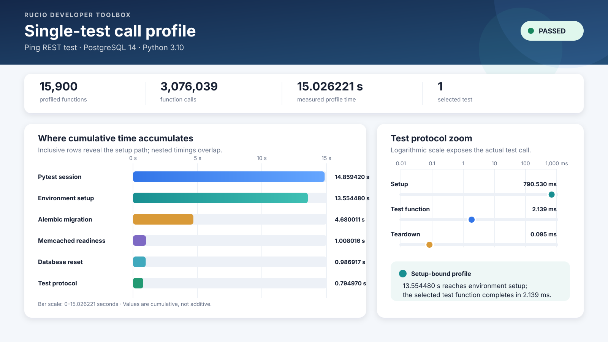

   A static vector rendering of genuine single-test call-profile data covering
   15,900 functions and 3,076,039 calls. It exposes overlapping cumulative
   setup paths and a logarithmic view of the selected test phases; open the
   generated ``calls.html`` for the complete own/cumulative table. This
   instrumented example is diagnostic, not a baseline.

In this short example the Rucio ``pytest_sessionstart`` and
``InfraManager.setup`` rows have very little own time but more than 13 seconds
of cumulative time. Their descendants, rather than those functions' bodies,
therefore dominate the measured setup path; select a longer application
workload before treating setup as the optimization target.

The Yappi data is saved in pstats format and can also be inspected with::

    python3 -m pstats .rucio-dev/artifacts/<run>/calls.pstats

At the prompt, ``sort cumulative`` followed by ``stats 30`` finds expensive
call trees; ``sort time`` finds high own CPU time. Worker threads are included,
but separately spawned processes are not combined into this call table.

For container resources without a Python profiler::

    ./tools/dev profile resources test remote-dbs-py310-postgres14 \
        tests/test_ping.py::test_rucio_ping_rest

Open ``resources.html``. Each Compose container has its own summary and charts:

* CPU is Docker's whole-container percentage and can exceed 100% when work uses
  more than one logical CPU;
* memory is Docker-reported container usage, not exact RAM attributed to a
  Python method;
* network receive/transmit and block read/write are cumulative container
  counters sampled during the window, so the first point can include activity
  from before sampling began; and
* PIDs is Docker's count of processes and kernel threads/tasks, not a Python
  process or thread count.

Each chart auto-scales independently. Compare numeric axes and timestamps, not
the apparent pixel height of two panels. Very short tests can produce only a
few points. Use the JSONL source when exact sample timestamps, counter deltas,
or custom plots are needed.

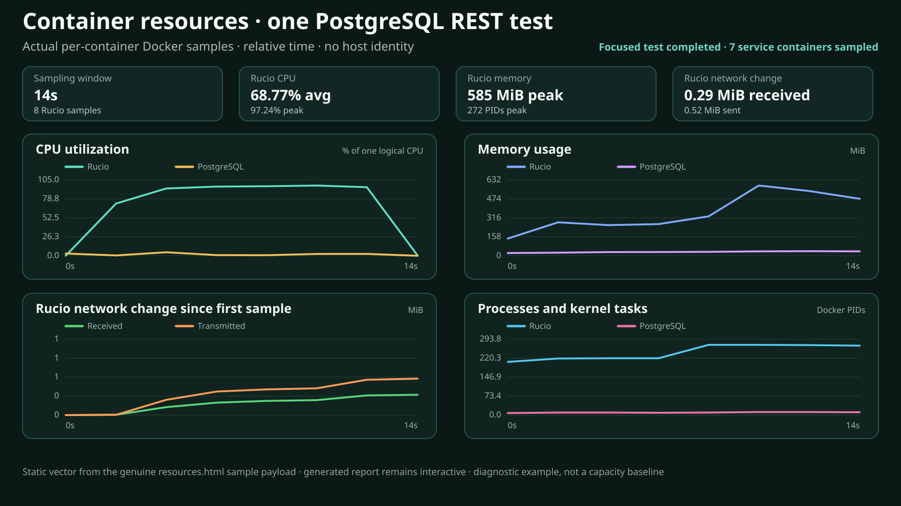

   A static vector rendering of the genuine ``resources.html`` sample payload.
   Compare numeric axes and time ranges across containers before associating a
   Rucio change with database or service activity; open the generated report
   for every container and sample. This is a diagnostic example, not a capacity
   baseline.

Profile the complete PostgreSQL autotest
~~~~~~~~~~~~~~~~~~~~~~~~~~~~~~~~~~~~~~~~

Omit the selector to collect an aggregate profile for the complete canonical
PostgreSQL case::

    ./tools/dev profile cpu test remote-dbs-py310-postgres14
    ./tools/dev profile resources test remote-dbs-py310-postgres14

CPU mode keeps the case's normal pytest worker model and follows its Python
subprocesses. Resource mode records the same parallel case without a Python
profiler. The resulting flame graph aggregates every test and worker, so it can
identify suite-wide hot stacks but cannot assign each sample to one pytest node
ID. Use the resource timeline to distinguish sustained suite load from a short
spike.

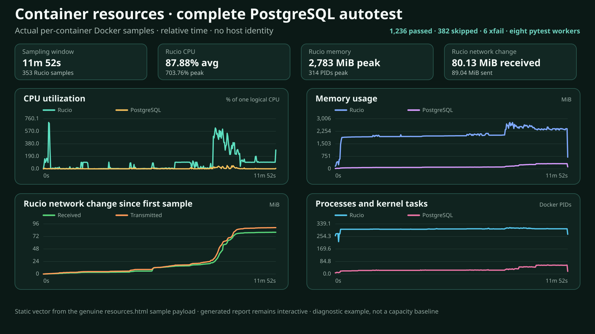

   A static vector rendering of genuine data from a complete resource run with
   eight pytest workers: 1,236 tests passed, 382 skipped, and six
   expected-failure (``xfail``) outcomes completed in 11 minutes 37 seconds with
   no failures or errors. The vector selects representative signals; the
   generated charts and JSONL retain the full 712-second sampling window. This
   is a diagnostic capture from one host, not a capacity baseline.

For this capture, the Rucio test container averaged 87.88% CPU and peaked at
703.76%, meaning that it used roughly seven logical CPUs at the peak. Its
memory peaked at 2,783 MiB, received 80.13 MiB, transmitted 89.04 MiB, read
25.84 MiB, wrote 91.41 MiB, and reached 314 PIDs. The PostgreSQL container
peaked at 50.27% CPU and 312 MiB while its counters increased by about 89 MiB
received, 80 MiB transmitted, and 136 MiB written. Read a rising cumulative
network or block-I/O line as activity during an interval, not as a rate or a
per-method attribution; use ``docker-stats.jsonl`` to calculate exact deltas
between two timestamps.

Complete-case ``memory`` and ``calls`` commands are also accepted, but they
disable implicit xdist to avoid one profiler artifact per pytest worker. Memory
still renders a separate report for each captured fork; calls covers the parent
process and its threads. These modes are therefore much slower and can create
large artifacts; prefer a module or node selector after the performance report
has identified the area to investigate.
A profiled full case is diagnostic and is not comparable to the unprofiled
autotest benchmark described in `Performance reports
<#developer-toolbox-reports>`__.

Profile daemons, servers, and commands
~~~~~~~~~~~~~~~~~~~~~~~~~~~~~~~~~~~~~~

Prefer bounded daemon work so the artifact has a clear measurement window::

    ./tools/dev profile cpu daemon conveyor-submitter --run-once
    ./tools/dev profile memory daemon hermes --run-once
    ./tools/dev profile calls daemon reaper --run-once
    ./tools/dev profile resources daemon undertaker --run-once

The toolbox selects mapped service capabilities from the daemon name. CPU mode
can sample supported child processes. Memory mode renders a separate report for
the parent and each captured fork. Calls mode covers all Python threads in the
target process but does not combine spawned processes. Docker's PIDs series can
indicate that more tasks existed; it cannot identify which Python method owned
them.

VS Code and PyCharm both provide **Rucio: Profile daemon**, prompting for the
mode, daemon, and a bounded option. An unbounded daemon can be stopped with
**Ctrl+C**; the toolbox waits for the profiler to release its files before it
finalizes the artifact.

The same modes accept the development server and a real Python command::

    ./tools/dev profile cpu server
    ./tools/dev profile memory command -- \
        python tools/convert_database_vo.py --help

For a server profile, generate a controlled request workload from another
terminal, record its request count and duration, then stop the server. An
interactive profile without a fixed workload is diagnostic, not a benchmark.
The server target is Flask application code; Apache/mod_wsgi and deployment TLS
are outside the supported Python profile path.

Observe an interaction in Grafana
~~~~~~~~~~~~~~~~~~~~~~~~~~~~~~~~~

Use OpenTelemetry when latency crosses Python, SQLAlchemy, HTTP, or another
service. Start a bounded target::

    ./tools/dev observe daemon hermes --run-once

Instrument an exact command with the same workspace and telemetry services::

    ./tools/dev observe command -- python -c \
        'from rucio.client import Client; print(Client().ping())'

Observe one canonical test with one pytest worker::

    ./tools/dev observe test remote-dbs-py310-postgres14 \
        tests/test_download.py::test_overlapping_containers_and_wildcards

The test command instruments pytest as ``rucio-test-client`` and HTTPD as
``rucio-test-server``. It attaches the disposable test container to the
checkout telemetry network. The test project is still removed after the run.
Each invocation adds its test selector, resolved case, and unique run ID to the
root span. The final output contains a direct Tempo link which selects only
that invocation.

The printed test log directory contains ``observation.json``. This records the
same identity, the test exit code, the Tempo query, and the direct link. A
rerun has the same selector but receives a new run ID and a new link.

For an API request workflow, run ``./tools/dev observe server`` and send a
request to ``http://127.0.0.1:8080`` from another terminal. These observation
commands start the local Grafana LGTM service and print::

    Grafana: http://127.0.0.1:3001

For an observed test, open the ``Tempo trace`` link printed after cleanup. No
data source selection or manual attribute entry is required.

To inspect the daemon run:

#. Open Grafana, choose **Explore**, and select the **Tempo** data source.
#. Search for service ``rucio-daemon`` and span ``rucio-daemon.run`` over the
   time range containing the command. For the server target, use
   ``rucio-server`` and ``rucio-server.run``.
#. Open the trace and expand the root span. Compare child SQL or HTTP span
   duration with the root duration. A span measures elapsed latency, not CPU
   time. Test HTTP spans continue into ``rucio-test-server`` when trace context
   crosses the request.
#. Use the span's log link when present to open the correlated Loki records. If
   switching to **Loki** manually, keep the same time range and search with the
   trace ID shown by Tempo. Absence of a log means that operation emitted no
   instrumented log record; it does not mean that no code ran.
#. The test command prints its private ``.test-logs`` directory. Inspect
   ``observation.json`` for the run identity. Inspect ``httpd_error.log`` when
   an HTTPD file handler did not export a record to Loki.
#. To inspect emitted metrics, select **Prometheus** and use its metric browser
   rather than assuming a name. Available runtime and instrumentation metrics
   depend on the target and installed OpenTelemetry instrumentors.

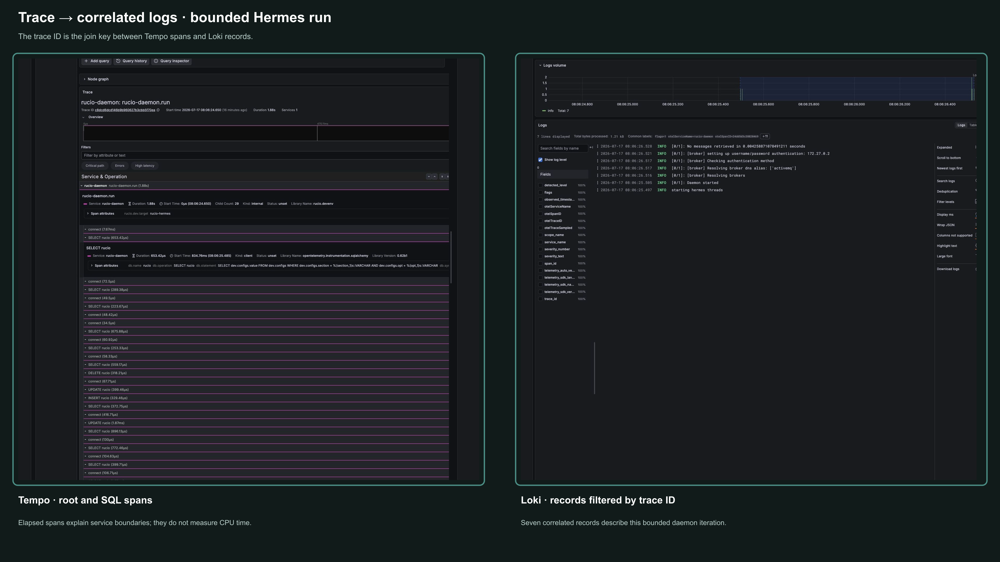

   A focused composition from a genuine bounded Hermes capture. The 1.88-second
   trace contains 30 spans, and the exact trace ID selects seven Loki records.
   This unseeded iteration retrieved no messages, so it demonstrates navigation
   and correlation rather than daemon throughput or a performance baseline.

When an instrumented target exits, the toolbox restores the base workspace
without OpenTelemetry environment injection. Grafana and its checkout-scoped
telemetry volume remain available for investigation until ``./tools/dev down``
or ``./tools/dev reset``.

The test client exports traces but not its DEBUG log stream or runtime metrics.
This avoids telemetry exporter messages feeding back into pytest output. The
observed HTTPD process retains the normal telemetry settings. OpenTelemetry has
no automatic ActiveMQ or STOMP instrumentation in this runtime. A long HTTP
server span can therefore contain a broker wait without a broker child span.

Granularity and limits
~~~~~~~~~~~~~~~~~~~~~~

No view meters exact CPU, RAM, and network bytes for every Python method:

* the CPU flame graph attributes samples to stacks but not network bytes;
* Memray attributes allocations contributing at peak, not all container memory
  or PostgreSQL memory;
* Yappi attributes Python call CPU time across threads in one process, with
  instrumentation overhead;
* Docker stats measures a whole container, and network/block counters include
  every operation during the window; and
* OpenTelemetry attributes elapsed time only to instrumented operations and
  explicit spans.

Combine the views by time: use the container timeline to locate a resource
change, Tempo and Loki to identify the operation, and CPU, allocation, or call
profiles to explain its Python work. Compare profiled runs only with the same
profiler and workload; profiler overhead makes them unsuitable as replacements
for the unprofiled benchmark in `Performance reports
<#developer-toolbox-reports>`__.

From a slow test to a source-level cause
~~~~~~~~~~~~~~~~~~~~~~~~~~~~~~~~~~~~~~~~~

Use this sequence for a defensible investigation:

#. Run the unprofiled full PostgreSQL report on a quiet host and identify a
   repeatable slow-tail test or subsystem.
#. Re-run that node unprofiled with the same case. A one-off parallel-suite
   outlier can be database or worker contention rather than slow application
   code.
#. Collect ``resources`` first to locate CPU, memory, database, or I/O activity
   in time. Then select CPU, memory, or calls for the narrowest Python question.
#. If latency crosses SQLAlchemy, HTTP, messaging, or another service, repeat a
   controlled interaction with ``observe`` and correlate Tempo and Loki by
   trace ID.
#. Form a source-level hypothesis, change one variable, and repeat the same
   focused workload. Treat every profiler result as diagnostic evidence.
#. Validate an optimization with multiple alternating, unprofiled baseline and
   candidate reports. Profiler output alone is not a performance claim.

.. _developer-toolbox-reports:

Performance reports
-------------------

.. _developer-toolbox-latest-result:

Find a completed result
~~~~~~~~~~~~~~~~~~~~~~~

A completed performance run prints the URI of its ``report.html``. A failure
during an image build or before JUnit output may produce no report directory.
To print the URI of the newest completed performance report or profiler
artifact later, run::

    ./tools/dev report latest

Profiler artifacts live below ``.rucio-dev/artifacts`` and are interpreted in
`Profiling and observability <#developer-toolbox-profiling>`__. The remainder of
this chapter concerns the suite performance report below
``.autotest/performance``.

Validate the report pipeline
~~~~~~~~~~~~~~~~~~~~~~~~~~~~

The reporter always uses the canonical
``remote-dbs-py310-postgres14`` case. Stop the ordinary workspace first so its
containers do not contaminate the measurement, then start with one diagnostic
test::

    ./tools/dev down
    ./tools/dev report --workers 1 tests \
        tests/test_ping.py::test_rucio_ping_rest

This validates source snapshotting, runtime selection, fresh PostgreSQL setup,
pytest execution, cleanup, and HTML generation. It is not a full autotest
benchmark and cannot be compared with a full-case report.

Run the complete PostgreSQL autotest
~~~~~~~~~~~~~~~~~~~~~~~~~~~~~~~~~~~~

Stop this workspace and every other Rucio checkout, then use a fixed worker
count on an otherwise quiet host::

    ./tools/dev down
    ./tools/dev report --workers 4 tests

The reporter snapshots the current ``HEAD`` plus staged, unstaged, and
untracked non-ignored files into a temporary Git worktree. A misplaced
non-ignored credential is therefore copied and mounted into the benchmark
runtime; inspect ``git status --short`` before starting. The reporter builds or
reuses the matching native AlmaLinux 10/Python 3.10 runtime, creates a fresh
isolated Compose project and PostgreSQL volume, and runs the complete case. It
does not modify the working checkout.

Do not run another resource-intensive test, profile, build, or report at the
same time. The reporter rejects concurrent report invocations for the same host
user and warns when other Rucio containers are already running. On **Ctrl+C**,
allow the project-scoped cleanup to finish before starting another report.

Once the runner reaches report generation, it creates a private timestamped
directory below ``.autotest/performance`` containing:

* ``report.html`` -- a self-contained summary and interactive ranked chart;
* ``junit.xml`` -- pytest results and source testcase durations;
* ``timings.json`` -- machine-readable per-test timing and status records; and
* ``metadata.json`` -- source, outer command and exit code, host, runtime,
  dependency-image, isolation, worker, timing, result, and comparability data.

Immediately after Compose starts, the canonical adapter records the exact image
ID used by each running container and any repository digests attached to it.
This happens before tests and teardown, so a tag changing later cannot alter the
record. It also reads CPU affinity and cgroup CPU/memory limits from the actual
running test container rather than from a replacement probe container. The
resolved canonical case, benchmark-harness fingerprint, collected test-manifest
fingerprint, runtime image ID and build-input fingerprint, external dependency
fingerprint, Python and xdist versions, worker count, Docker server identity
and capacity, and effective container CPU and memory limits form the comparison
identity. The temporary worktree, network, database volume, and Compose project
are removed; the fingerprinted runtime image and completed report remain.

IDE report actions
~~~~~~~~~~~~~~~~~~

VS Code provides the **Rucio: Full PostgreSQL performance report** task.
PyCharm provides **Rucio: Full PostgreSQL report**. Both run the complete
``remote-dbs-py310-postgres14`` report with four fixed workers and print the
result URI in their terminal. Run ``./tools/dev down`` first, and stop every
other Rucio checkout. Use the terminal command above for a diagnostic selector
or another worker count.

Read the HTML report
~~~~~~~~~~~~~~~~~~~~

Start with **Comparable** and **Benchmark context**, not the slowest row. A
nonzero canonical-runner exit, incomplete cleanup or runtime identity,
unconfirmed workers, or pre-existing Rucio containers marks the run
non-comparable. Confirm the source, selection, configured and observed workers,
Docker server and runtime resources, runtime image fingerprint, and external
dependency fingerprint. **Comparable: yes** confirms those recorded identity
and protocol checks; it does not prove statistical equivalence. Host thermals,
dynamic CPU frequency, and unrelated background load are not captured. Then
interpret:

* **Pytest wall time** as elapsed test-session time and the primary suite
  duration;
* **Summed test time** as the sum of overlapping testcase durations across
  workers, which can exceed wall time;
* **Effective concurrency** as summed testcase time divided by pytest wall
  time, influenced by collection, fixtures, database contention, and idle
  workers;
* **Harness wall time** as the outer canonical adapter run, including service
  pull/startup, database setup, pytest, and cleanup, but not a runtime image
  build completed before that run;
* **Harness overhead** as harness wall time minus pytest wall time;
* **Median, P95, P99, and max** as the per-test duration distribution; and
* **Tail share** as the fraction of summed testcase time held by the slowest
  five percent.

The ranked chart is not cumulative. Each point is one test ordered from fastest
to slowest on a logarithmic duration axis. Hover for its node ID, status,
duration, percentile, and tail cutoff. The module and class tables show whether
slow-tail time is concentrated in one subsystem. Expected failures (``xfail``)
and non-strict unexpected passes (``xpass``) are counted separately; an
``xpass`` does not inflate the passed count.

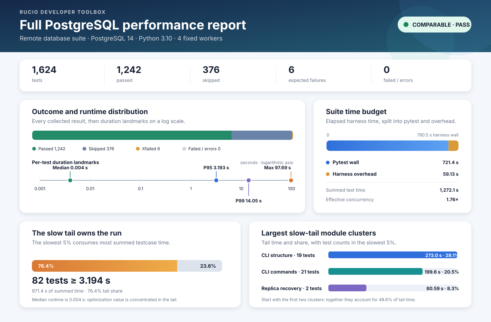

   A static vector rendering of genuine data from a complete
   ``remote-dbs-py310-postgres14`` report: all 1,624 collected tests completed
   with 1,242 passes, 376 skips, six expected-failure (``xfail``) outcomes, and
   no failures or errors. The reporter observed all four configured workers and
   marked the run comparable. Open the generated HTML for the complete
   provenance, tables, and interactive chart. This is an example measurement
   from one host, not a release baseline.

In this example pytest used 721.4 seconds of wall time while overlapping test
durations summed to 1,272.1 seconds, giving 1.76x effective concurrency. The
outer harness took 780.5 seconds, so service and database setup plus cleanup
added 59.13 seconds. The slowest five percent held 76.4% of summed test time;
that concentration makes the tail tables and focused follow-up runs more useful
than optimizing a typical 0.004-second test.

A slow test under parallel load can be waiting for PostgreSQL, another service,
or a worker slot. Confirm it with the same focused, unprofiled test before using
the method and resource tools in `Profiling and observability
<#developer-toolbox-profiling>`__.

Compare baseline and candidate
~~~~~~~~~~~~~~~~~~~~~~~~~~~~~~

Use this workflow for a performance claim:

#. On a quiet host, run the full report for the baseline source.
#. Run the candidate with the same worker count and Docker resource limits.
#. Confirm both reports say **Comparable: yes**, then confirm their comparison
   key and selection match. The key already covers the resolved canonical case,
   benchmark harness, collected test manifest, workers, exact runtime build and
   image identities, dependency images, Python, xdist, Docker server identity
   and capacity, and effective container limits.
#. Verify the source fingerprint identifies the intended baseline or candidate.
   Application source is deliberately outside the comparison key: it is
   expected to differ between baseline and candidate, while repeated runs of
   the same source should use the same fingerprint.
#. Alternate baseline and candidate runs several times. Compare pytest wall
   time and the distribution or tail relevant to the change rather than using
   one absolute result.

Treat diagnostic selections versus full-suite reports, a nonzero runner exit,
mismatched comparison keys, unconfirmed workers, architecture-emulation
changes, incomplete cleanup, or busy-host runs as non-comparable. If the
candidate intentionally changes a runtime or service dependency, the key must
differ; state the changed input explicitly because the timing difference cannot
be attributed to source code alone.

Share and retain reports
~~~~~~~~~~~~~~~~~~~~~~~~

``report.html`` is self-contained. Share ``metadata.json`` with it so reviewers
can verify provenance and comparability, and include ``timings.json`` for
downstream analysis. Inspect and, when necessary, sanitize every file before
publishing. The HTML, metadata, timings, and JUnit can expose absolute host
paths, usernames, branch and source fingerprints, OS and kernel details,
Docker capacity, identifiers, failure output, or workload data.

Report directories are private to the host user and are not removed by
``./tools/dev reset``. Delete old directories below ``.autotest/performance``
only when no report command is running.
